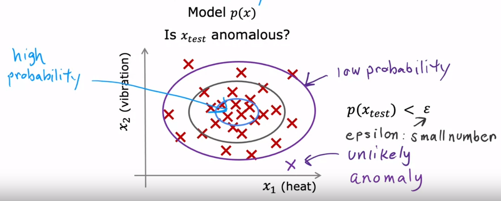

# Anomaly Detection

Anomaly detection algorithms look at an unlabeled data set and determine unusual or abnormal data points or events. Common use cases include applications where unusual activity is a problem, such as fraud detection, quality analysis in manufacturing, and monitoring computers in data centers.

## Density Estimation

The most common way to carry out anomaly detection is with an algorithm called density estimation. Given a dataset $\{x^1, x^2, \dots, x^m \}$ , the density estimation algorithm computes a model $p(x)$, which is the probability of $x$ being seen in the dataset. 

If this were to be graphed, boundaries form around the data, corresponding to various probabilities. As the data move closer to the “center” of the data, it has a higher probability. Likewise, as it moves further away, its probability decreases.

In order to detect an anomaly, a cutoff point must be set, which is represented by $\epsilon$. This is usually a smaller number, depending on the application. New data is fed into the model and compared to this value. Then an anomaly (or not) is applied to the new training examples. This relationship is represented as,

$$
\text{anomaly} = p(x_{test}) < \epsilon
$$

# Gaussian (Normal) Distribution

In order to find an optimal probability cutoff $\epsilon$ and apply anomaly detection, gaussian or normal distribution is used. This is commonly referred to as a bell curve. Given a value $x$, the probability of $x$ is determined by a Gaussian with mean $\mu$ and variance $\sigma^2$. Variance is derived from the standard deviation, which is $\sigma$. Since probabilities always sum up to 1, the area under the curve is also equal to 1.

The equation for the probability as a function of $x$ is as follows,

$$
p(x) = \frac{1}{\sqrt{2\pi\sigma}} e^\frac{-(x-\mu)^2}{2\sigma^2}
$$

To compute the mean, the values are simply averaged,

$$
\mu = \frac{1}{m} \sum^m_{i=1}x^{(i)}
$$

Since the standard deviation is simply the difference between the data points and the mean, the variance is this value squared,

$$
\sigma^2 = \frac{1}{m} \sum^m_{i=1}(x^{(i)}-\mu)^2
$$

# Defining the Algorithm

Taking the density estimation and Gaussian distribution, a more formal definition for the anomaly detection algorithm is made:

Given a training set: $\{ \vec x^{(1)}, \vec x^{(2)}, \dots, \vec x^{(m)} \}$, where each example $\vec x^{(i)}$ has $n$ features,

$$
X = \begin{bmatrix}\vec x^{(1)} \\ \vec x^{(2)} \\ \vdots \\ \vec x^{(n)} \end{bmatrix}
$$

$$
\vec x = \begin{bmatrix}x_1 \\ x_2 \\ \vdots \\ x_n \end{bmatrix}
$$

The model for probability is defined as follows, where the mean $\mu$ and variance $\sigma^2$ are parameters to the probability function,

$$
p(\vec x) = p(x_1; \mu_1, \sigma_1^2) * p(x_2; \mu_2, \sigma_2^2) * \dots * p(x_n; \mu_n, \sigma_n^2)
$$

A more compact way to write this function is below,

$$
p(\vec x) = \prod^n_{j=1} p(x_j; \mu_j, \sigma_j^2)
$$

## Putting it all together

1. Choose $n$ features $x_i$ that might be indicative of anomalous examples.
2. Fit parameters $\mu_1, \dots, \mu_n$ and $\mu_n^2, \dots, \sigma_n^2$:
    
    $$
    \mu_j = \frac{1}{m} \sum_{i=1}^m x_j^{(i)}
    $$
    
    $$
    \sigma_j^2 = \frac{1}{m} \sum_{i=1}^m (x_j^{(i)} - \mu_j)^2
    $$
    
    ### Vectorized formula
    
    $$
    \vec \mu = \frac{1}{m} \sum_{i=1}^m x^{(i)}
    $$
    

$$
\vec \mu = \begin{bmatrix}\mu_1 \\ \mu_2 \\ \vdots \\ \mu_n \end{bmatrix}
$$

1. Given new example $x$, compute $p(x)$:

$$
p(\vec x) = \prod^n_{j=1} p(x_j; \mu_j, \sigma_j^2) = \prod^n_{j=1} \frac{1}{\sqrt{2\pi\sigma_j}} exp\Big({\frac{-(x_j-\mu_j)^2}{2\sigma_j^2}}\Big)
$$

1. Determine an anomaly if $p(x) < \epsilon$

# Evaluating the Model’s Performance

When developing any learning algorithm (choosing features, etc.) making decisions is much easier if there is a way to evaluate the algorithm. There is a technique to produce a single number or value, which is used as an evaluation metric to gauge performance. This process is called real-number evaluation.

In the case of anomaly detection, there is one needed step, which is to assume there is some labeled data of anomalous $y=1$ and non-anomalous (normal) examples. The initial training set should contain all anomalous data $(y=1)$, but if a few examples are not that is fine. Then cross validation and test sets are created. Ideally, both of these sets should contain mostly normal examples and a few anomalous examples. 

$$
y = \begin{cases} 1 & \text{if $p(x) < \epsilon$ (anomaly)} \\ 0 & \text{if $p(x) \ge \epsilon$ (normal)}  \end{cases}
$$

### Cross validation set

$$
(x_{cv}^{(1)}, y_{cv}^{(1)}), \dots, (x_{cv}^{(m_{cv})}, y_{cv}^{(m_{cv})})
$$

### Test set

$$
(x_{test}^{(1)}, y_{test}^{(1)}), \dots, (x_{test}^{(m_{test})}, y_{test}^{(m_{test})})
$$

After the algorithm has been trained on the training set, the cross validation set is used to fine to the probability boundary $\epsilon$. Epsilon can be fine tuned by looking at what data was incorrectly labeled. Fine tuning features $x_j$ is also an options here. Once all parameters have been optimized, the model can be implemented on the test set for a final verdict. 

Alternatively, there are times when it is best to not use a test set and only a cross validation set; for example, if training data contains very few labeled anomalous examples or the data set itself is small. The downside is the model cannot test the parameters after being fine tuned, so there is a higher risk of overfitting.

## Possible evaluation metrics

Just like other classification problems, there are alternative metrics to help increase the accuracy of the model. These metrics are particularly useful for very skewed data. 

- True, positive, false positive, false negative, true negative
- Precision/Recall
- F1-score

Regardless of what approach is used, the key is to find the best value for the probability boundary $\epsilon$. 

# Comparing to Supervised Learning

Since anomaly detection requires labeled data for the cross validation and test sets (at the very least), wouldn’t it make more sense to use a supervised learning algorithm? Well, this can sometimes be the case, and the choice between the two is often subtle.

### Anomaly detection

### Supervised learning

---

The first criteria lies in the data itself; specifically with how many of the examples are positive or negative. 

- Works the best when the dataset has a very small number of positive examples $(y=1)$ (0-20 is common) and a large number of negative $(y=0)$ examples.

- Works well when the dataset has a large number of both positive and negative examples; or, at the least, it’s not as skewed as an anomaly detection dataset.

---

When future anomalies occur, especially ones that look nothing like any of the anomalous examples seen so far, the two approaches can be quite different.

- Since this data contains a large number of negative examples, it is hard for the algorithm to learn from positive examples what anomalies look like. Therefore, it is more likely to flag many different types of future anomalies it hasn’t seen before.

- Enough positive examples exist for the algorithm to get a sense of what they are like, so future positive examples are likely to be similar to ones in the training set. Therefore, it is harder to catch different types of anomalies the model hasn’t seen before.

A use case to illustrate this difference is manufacturing. Anomaly detection is more useful for finding new, previously unseen defects, while supervised learning is more useful for finding known, previously seen defects. 

# Fine Tuning Features

With supervised learning, if features are not right or relevant to the problem, that is ok because the algorithm intuitively figures out what features to ignore, rescale, etc. However, for anomaly detection, which runs with unlabeled data, it is harder for the algorithm to account for these potential problems. Thus, carefully choosing features is especially important. 

## Transforming features

One important step to enforcing efficient features is to make sure they are Gaussian. In other words, the data for that feature should closely resemble a symmetric bell curve. There are several tricks to converting non-gaussian features, one of which is directly manipulating the data. For example, given feature data $x$, one could take $log(x)$, $e^x$, $\sqrt x$, or any other mathematical transformation for that matter.

## Error analysis

After modeling the initial training data, if it does not test perform well on the cross validation set, there is also the option of carrying out error analysis. More simply, this involves looking at errors and trying to reason why they are behaving that way.

This usually starts with evaluating the probability function $p(x)$. Remember, the two conditions for an optimal model are:

1. $p(x)$ is large for normal examples $x$. 

$p(x) \ge \epsilon$

1. $p(x)$ is small for anomalous examples $x.$

$p(x) \lt \epsilon$

The most common problem regarding error analysis is:

- $p(x)$ is comparable for normal and anomalous examples (usually a large value for both).

When an anomalous example has a large value for $p(x)$, it can often go undetected and will not get flagged by the algorithm. 

Deriving a new feature $x_2$ from the problem feature $x_1$ can help solve this problem. The values in the data do not necessarily have to be directly derived, but the two features should be very closely related. 

When these two data features are plotted against each other, it can make the anomalies stand out much more clearly. 

For example, consider a fraud detection algorithm, where the original feature is the number of transactions, and the additional feature is typing speed (which would directly related to getting out fast transactions). 

Existing features can also be combined into new features. Moreover, mathematical transformations can be applied too. For example, a new feature $x_3$ for a data center algorithm could be defined as,

$$
x_3 = \frac{(\text{CPU load})^2}{\text{network traffic}} = \frac{(x_1)^2}{x_2}
$$