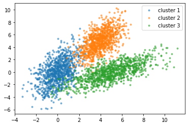

# Clustering

Clustering is a unsupervised algorithm that looks at data points and automatically finds data points that are related or similar to each other. It is very similar to classification problems. However, clustering (and unsupervised learning as a whole) does not provide the target labels $y$. The algorithm is tasked with finding the relationship between the data instead. 

Clustering is useful where the data being classified is less intuitive to predict, such as grouping similar news articles, where it is hard to predict what article contents will be printed in the future.

# Defining the K-means Algorithm

The most common clustering algorithm is K-means clustering. It works by first taking a random guess at where the centers (cluster centroids) of the $K$ clusters it is tasked with classifying. These are dynamic and are open to moving, which is a core tenant of the algorithm. After the first centroids are picked, the distance between all other data points and each of the centroids is calculated. Data points are grouped into whichever centroid is closest. 

Then for each cluster, the algorithm takes an average of all the points and moves the centroid to that average location. This whole process is then repeated over again, until the centroids do not move any more and the boundaries become more or less set. 

## Pseudocode

For randomly initialized $K$ cluster centroid coordinates $\mu_1, \dots, \mu_K$, $m$ training examples, and $n$ features,

Repeat {

*Assign points to cluster centroids*

for $i=1$ to $m$:

$c^{(i)}:=$ index (from 1 to $K$) of cluster centroid closest to $x^{(i)}$

$= {min}_K {\| x^{(i)} - \mu_K \|}^2$

*Move cluster centroids*

for $k = 1$ to $K$:

$u_K :=$ mean of points (vectors of size $n$) assigned to cluster $k$

}

## Defining the Cost Function

Given the following definitions,

$c^{(i)} =$  index of cluster (1, …, $K$) to which example training example $x^{(i)}$ is currently assigned

$u_k =$  cluster centroid $k$

$u_{c^{(i)}} =$  cluster centroid of cluster to which example $x^{(i)}$ has been assigned

the cost function is defined as,

$$
J(c^{(1)}, \dots, c^{(m)}, \mu_1, \dots, \mu_K) = \frac{1}{m} \sum_{i=1}^m {{\| x^{(i)} - \mu_{c^{(i)}} \|}^2}
$$

Because of the nature of the cost function’s definition regarding distances, minimizing the cost function should always converge to a stop and should never go up. If it does, then there is a bug in the code. Like running gradient descent, sometimes the cost function will take increasingly smaller steps, and the algorithm can be stopped when this increment is too small.

# Initializing K-means

Mentioned earlier, the first step of the algorithm is to randomly initialize $K$ cluster centroids $u_1, \dots, u_k$. The number of clusters $K$ should be less than the number of training examples $m$, as it doesn’t really doesn’t make sense otherwise. Depending on what initial cluster centroids are picked, the algorithm will arrive at different clusters. For example, consider cluster centroids grouped together at one corner of the graph vs clusters evenly spaces across it.

One approach to handling this possibility is to run the algorithm multiple times, then minimize the cost function $J$ for each of the cases. The cost function will be higher for sub-optimal clusters, because many data points will be stretched further away from centroids than they should. Then, pick the set of clusters giving the lowest cost. Typically, anywhere from 50 to 1000 random initializations are used to find an optimal set of initial clusters. Any more than this becomes too computationally expensive with diminishing returns.

## Choosing the Number of Clusters

For many applications, the right value of $K$ is ambiguous, as it is possible to cluster data in many different ways depending on how the data is interpreted. There are a few automatic techniques for finding the number of clusters. 

One way is called the elbow method, which runs the algorithm with a variety of values for $K$, while plotting them against the cost function $J$, to find the $k$ with the most change in cost function decrease. When graphed, this point often looks like an elbow. Though, this technique is not usually recommended, because the cost function typically decreases in a smooth line.

So, how should the number of cluster be chosen? Clustering algorithms are often used for some later (downstream) purpose in modeling. Thus, it is recommended to evaluate K-means based on how well it performs on that later purpose. 

For example, say a clustering algorithm is running to determine shirt sizes based on height and weight data. Instead of picking arbitrary $K$ values, it makes more sense to pick values based on existing sizing standards (i.e. S, M, L). Even this can be varied, depending on how detailed the sizing can be.

