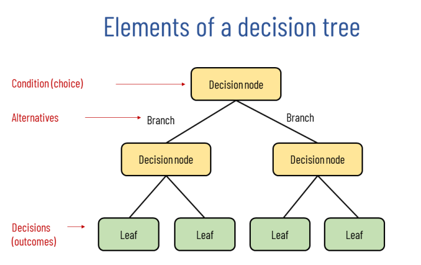

# Decision Trees

Decision trees take parameters of a model and organize them into a tree structure, so one use the outputs of each parameter to make a decision. Decision trees to do not have to be binary, so they can have multiple decisions per node. When a leaf node is reached, this will output a final classification. Thus, decision trees are especially useful for classification and regression problems. 

# Defining the Model

The first step of constructing a decision tree is decided what feature to use at the root node. This is followed by recursively adding the rest of the features to fill out the tree. The goal is all leaf nodes will contain a uniform output (single, correct decision). If a lead node doesn’t, then it needs to be split again with an another parameter, so the data is labeled correctly. 

There are several important decisions that need to be made throughout this process. The first is how to choose what feature to split on at each node. The goal here is to maximize purity (or minimize impurity) at each node. In other words, ideally, there should be one class at each node. 

The second key decision is deciding when to stop splitting. The most obvious is when a node is 100% one class. Another is when splitting a node will result in the tree exceeding a maximum depth. Limiting depth and keeping a tree small will make it less prone to overfitting. 

Splitting can also be stopped when improvements in purity score are below a threshold. Eventually, purity can change very little (like running gradient descent too long) or even increase. Finally, another reason is when the number of examples in a node is below a threshold. One might do this because the number of examples is really small and there might only be a few outliers in the classification. Additional splitting might lead to overfitting. 

# Entropy and Information Gain

Entropy $H$ is a measure of the impurity in a set of data. Consider the following graph for entropy, where $p_0 \dots p_n$ represent each fraction of training examples for $n$ classifications. When the data fits into one category, it will have an impurity score of 0 (purity of 1). If the data is evenly distributed across categories, it’s impurity will be 1 (purity of 0). 

Since the entropy of a category is a fraction of 1, then all entropies for the dataset must sum to 1. In an example with two categories, consider the following equations for purity and entropy.

$$
p_0 = 1 - p_1
$$

$$
H(p_1) = -p_1\log_2(p_1) - p_0\log_2(p_0) \\ =-p_1\log_2(p_1) - (1-p_1)\log_2(1-p_1)
$$

Note, for cases of 0 entropy, some of the log equations above will simplify to $0\log(0)$, which computes to undefined. For this use case, it will instead simplify to 0, even though it is not mathematically correct. 

## Choosing a Split: Information Gain

Splitting a node is based on what choice of feature reduces entropy (maximize purity) the most. The process of reducing entropy is called information gain. After calculating the entropy values for each possible split (one entropy value per class, per split), instead of comparing the entropies individually, it is more useful to take a weighted average.

Consider the following equation for calculating the weighted average (entropy) for a given split, where $p_1 \dots p_C$ refer to the nodes resulting from the split and $w$ is the fraction of split nodes from pre-split nodes,

$$
E = \Big( w_1 H \left( p_1 \right) + \cdots + w_C H \left( p_C \right) \Big)
$$

This can be written more generically as, for the $i^{th}$ class in $C$ classes,

$$
E = \sum_i^C w_iH(p_i)
$$

However, the reduction of entropy, rather than just entropy, is required. Context is needed to calculate the reduction, so the entropy of the root node is used.

### General Information Gain Algorithm

$$
E = H(p_{root}) - \sum_i^C w_iH(p_i)
$$

This reduction in entropy is called in the information gain. After each split is calculated, the one with the highest value is chosen. The reduction in entropy, rather than just entropy, is used because one of the criteria for ordering a stop of a split is if the reduction in entropy is too small. At a certain point, the reduction in entropy is not worth the split. 

# Building the Decision Tree

To build a decision tree, start with all examples at the root node, then calculate information gain for all possible features. The feature with the highest information gain is picked. Next, split the dataset according to the selected feature, creating branches of the tree. 

Finally, recursively repeat the splitting process until the stopping criteria is met:

- A node is 100% one class.
- Splitting a node will result in the tree exceeding maximum depth.
- Information gain from additional splits is less than a threshold.
- The number of examples in a node is below a threshold.

## One-hot Encoding

One-hot encoding is the process of accounting for more than two features, when conducting a split. With two features, the class can simply use a binary classification to distinguish between them (e.g. round or not round, present or absent, 0 or 1, true or false, etc.). However, when there are more than two, the possible features must be split into their own class, with a value of 0 or 1 to represent if present or not.

More precisely, if a categorical feature can take on $k$ values, create $k$ binary features (0 or 1 valued). 

One-hot encoding is not just used for decision trees. Any application where parameters need to be split and/or encoded, like neural networks, benefit from it. It allows for encoding categorical features into values a machine can understand.

## Continuous-valued Features

Often times, values in a parameter are continuous and don’t fit into a binary classification (e.g. weight in lbs.). Finding a split requires a little more thought, but luckily there is a process for deciding when to split on a continuous variable. 

At every node, when considering splits, consider different values to split on and calculate the information gain at those values. Compare them, and choose whichever has the highest information gain. That value becomes the threshold where to split, and the remaining values are sorted on either side. 

# Regression Trees

So far, the examples have been predicting a binary classification as the output $\hat y$ of the model (e.g. cat or dog). However, it is possible to predict a range of values instead, which is a regression problem, thus the tree is called a regression tree. 

Usually, the output $\hat y$ is the average of the remaining training examples at that leaf node. So, continuing the examples mentioned earlier, if the model is trying to predict a weight, the model will take weights from the training data $y$ and average them at each leaf node. 

The key overall decision when working with regression trees is deciding where to split. Instead of trying to reduce entropy at each split, the model tries to reduce variance. Variance computes how widely a set of numbers differ. At each split, even the first ones at the root, take into account the variance of the output values $y$.

$$
\bar v = \frac{\text{sum of output values}}{\text{no. of output values}}
$$

Information gain is still used to measure and compare the variance across potential splits. Consider the following, where $v$ is the variance of each split,

$$
E = H(v_{root}) - \sum_i^C w_iH(v_i)
$$