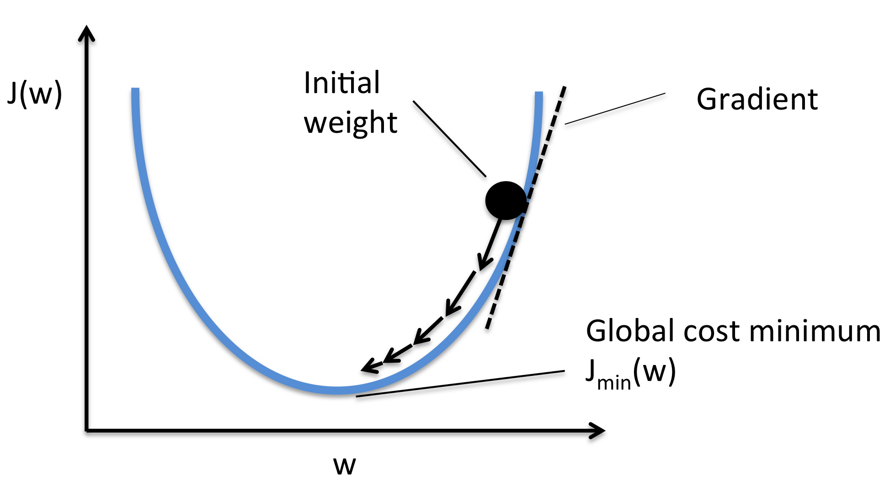

# Gradient Descent

The gradient descent algorithm is used all over the machine learning landscape; from optimizing [‣](https://app.notion.com/p/82a77381f9504a65bcd8e1ae545aa4ed?pvs=21)  to training some of the most advanced neural network models. The goal of gradient descent is to minimize any function, and it can take any number of parameters. 



# Defining the Model

## The Algorithm’s Goal

The goal of the algorithm is described below, with is to minimize a general function $J$, with a number of parameters $n$,

$$
\underset{w_1, ..., w_n, b}{min}J(w_1, w_2, ..., w_n, b)
$$

As parameters increase, the resulting minimum for J will become more complex and can even have multiple values. The algorithm works by starting at the most inefficient parameter selections (red peak spots on the graph), then working in small increments to find the shortest path to the minimum $J$ values (blue valleys). This process is repeated many times over for different starting points.


Notice how starting at slightly different spots on the peaks can result in completely different paths and resulting minimums. The lowest $J$ value on any given individual path is called the *local minima.* 

## Defining the Algorithm

The gradient descent algorithm is defined as a repeated convergence for each input parameter,

$$
w = w-\alpha \frac{\partial}{\partial w}J(w,b)
$$

$$
b = b-\alpha \frac{\partial}{\partial b}J(w,b)
$$

$\alpha$ = Learning rate, which is a value that control how big of a step is taken. This is usually a small positive number, between 0 and 1. A large alpha value corresponds to a bigger step and vice-versa. 

$\frac{\partial}{\partial (w,b)}J(w,b)$ = Derivative of the cost function, which determines the direction to take each step.

Notice how the combination of both these values gives the exact coordinate of the next point in the shortest path. Moreover, when subtracting its value from the previous parameter $w$ or $b$, a more optimized value is found and assigned. When the algorithm finally reaches its lowest point in a path, there will be nothing to subtract. The convergence to 0 for every input parameter is where the algorithm ends.

Since every parameter must be updated, it is extremely important to simultaneously update $w$ and $b$ at the same time. Otherwise, an updated value will incorrectly go into the cost function for another.

As for the derivative of the cost function, it is used because the derivative is the slope of the tangent line at point $w$ on the cost function curve. This is more easily understood if the algorithm is simplified to plotting the cost function $J(w)$ against $w$. As this tangent line approaches the bottom of the curve, its slope will approach 0, which results in a smaller decrease of $w$ in each step of the gradient descent path.


# Choosing a Learning Rate

The choice of learning rate $\alpha$ will have a huge impact on the efficiency of the overall algorithm. If the learning rate is too small, many more steps will be taken than required, so the total time for the algorithm will grow dramatically. On the other hand, if the learning rate is too large, then steps can miss the true minimum cost function, and the algorithm itself will actually diverge away from it.

Now, these examples above are for simple parabolic graphs. Optimizing $\alpha$ on more complex graphs can be more tricky. For example, consider a graph where there are several local minima separated by local maxima.


There is also another important question to answer, which is why the algorithm works with a fixed learning rate. This is because as the steps approach the local minima, they automatically become smaller due to the derivative itself becoming smaller (each subsequent slope is smaller as it approaches 0).

## Optimizations

### Learning curve

Recall that the goal of gradient descent is to minimize the cost function $J_{\overrightarrow w,b}$. Plotting the cost function against the number of iterations can show how effective it is from a quick glance. This curve is specifically called the learning curve. Ideally, the curve should converge to 0 as quickly as possible. If $J$ ever increases after an iterations, it can often signify a poor learning rate $\alpha$ selection or a bug in the code. 


Moreover, the number of iterations can vary significantly depending on application, which often makes it difficult to initially find how many iterations are needed for convergence. 

### Automatic convergence test

An automatic convergence test can also be used. This essentially sets a baseline value $\epsilon$ for how much the cost function should decrease by before stopping the algorithm. If $J(\vec w, b)$ decreases by $\le \epsilon$ in one iteration, declare convergence - The parameters $\vec w, b$ have been found. 

Determining an optimal baseline $\epsilon$ can be very tricky, and it is often best used in conjunction with a learning curve graph. 

### Debugging

While divergence from 0 or a cost function that moves up and down is often attributed to a learning rate that is too large, it can also be a bug in the code. Choosing an extremely small learning rate can help identify if this is a bug in the code, because the algorithm should still behave abnormally. 

# Gradient Descent for Linear Regression

Given all the equations and definitions above, almost everything is present to programmatically compute the gradient descent for a linear regression. However, there is one final piece missing, which is expressing the derivative of the cost function $\frac{\partial}{\partial w} J(w,b)$ and $\frac{\partial}{\partial b} J(w,b)$. 

Since the cost function and the linear regression model have already been expressed in terms of the input variables $x$ and $y$, they are substituted into the gradient descent algorithm. The derivative is then taken. Consider the following equations, where $m$ is the number of training examples in the dataset.

### Linear regression model

### Cost function

$$
f_{w,b}(x) = wx + b
$$

$$
J(w,b) = \frac{1}{2m} \sum_{i=1}^m (f_{w,b}(x^i) - y^i)^2
$$

### Pre-derived gradient descent algorithm

$$
w = w - \alpha \underbrace{\frac{\partial}{\partial w} J(w,b)} \space\space\space\space\space\Rightarrow\space\space\space\space\space \frac{1}{m} \sum_{i=1}^m (f_{w,b}(x^i) - y^i)x^i)
$$

$$
b = b - \alpha \underbrace{\frac{\partial}{\partial b} J(w,b)} \space\space\space\space\space\Rightarrow\space\space\space\space\space \frac{1}{m} \sum_{i=1}^m (f_{w,b}(x^i) - y^i)
$$

### Final gradient descent algorithm

$$
w = w - \alpha \frac{1}{m} \sum_{i=1}^m (f_{w,b}(x^i) - y^i)x^i
$$

$$
b = b - \alpha \frac{1}{m} \sum_{i=1}^m (f_{w,b}(x^i) - y^i)
$$

# Normal Equation - Alternative to Gradient Descent

The normal equation is a technique that serves as an alternative to gradient descent, but it is only for linear regression. It solves for $w, b$ without iterations. While it can be a simple alternative to gradient descent, it is slow when the number of features is large (> 10,000). 

An advanced linear algebra library is required, so engineers hardly utilize the normal equation directly. Is is usually used on the backend of machine learning libraries that implement linear regression. For most learning algorithms, gradient descent is often the better way to get the job done.

# Scaling and Engineering Features

Choosing a reasonable slope $w$ for each parameter is essential for running an accurate gradient descent algorithm. Some features will have relatively small values, while others will have big values, and the slopes must accommodate this relativity. Usually, a bigger $w$ value is chosen for smaller feature sizes $x_j$ and vice versa, which tends to balance the values out. In addition, the features themselves can be scaled. An example of this using $1000 ft^2$ instead of $ft^2$, when used in conjunction with the number of bedrooms. After this scaling, both parameter values should lie from around 0 to 20.

What happens if the features are not scaled? Well, this is probably best shown on a plot to visualize. If carefully selected $w$ values are not chosen, the algorithm can often overshoot its target, which will lead to divergence or much longer training times. Properly scaled features should fill an entire graph, when plotted relatively to each other. 


## Scaling Techniques

There are several techniques for scaling features. Considering the following range for each feature $x_j$, where $min \le x_j \le max$, the goal is to aim for a range of $-1 \le x_j \le 1$.

When using the mean and z-score normalization techniques below, it is often necessary to store these values for future use. Once the parameters from the model have been learned, and predictions for new data are needed, the new input data $x$ must be normalized. This normalization uses the mean and standard deviation previously computed from the training set.

### Relative maximum

The first technique is to take each feature and divide by the maximum in its range. which will normalize to a maximum of 1.

$$
\\ x_{j, scaled} = \frac{x_j}{max} 
$$

$$
\\ \frac{min}{max} \le x_{j,scaled} \le 1
$$

### Mean normalization

Here, each feature is normalized to 0, which when plotted, will center around the origin of the graph. This will usually produce values between -1 and 1 for both $x$ and $y$ axes of the graph. The mean value $u_j$ of all values of parameter $x_j$ is necessary for this calculation.

$$
\mu_j = \frac{1}{m} \sum_{i=1}^m x_j^{(i)}
$$

### Z-score normalization

$$
x_{\text{scaled}} = \frac{x - \mu}{\sigma}
$$

A z-score normalization utilizes the standard deviation $\sigma$ of each feature. In general terms, a standard deviation is also referred to as a normal distribution or gaussian distribution (bell-shape curve). 


Just like the mean normalization, the mean value $u_j$ is used. The results of this technique will produce values around the origin, but they will not necessarily be constrained by -1 and 1. Consider the following equations, for $m$ training examples for each feature. 

$$
\sigma_j = \sqrt{\frac{1}{m} \sum_{i=1}^m (x_j^{(i)} - \mu_j)}
$$

$$
x_j = \frac{x_j-\mu_j}{\sigma_j}
$$

## Feature Engineering

The concept of engineering features is to derive new features and enhance the accuracy of the model. This is usually done by transforming or combining existing features. For example, take predicting a home price, where two of the features being used are the frontage and depth (both in feet) of the land,

$$
f_{\vec w, b}(\vec x) = w_1x_1 + w_2x_2 + b
$$

Since the total area of the land can be used as well, this can be added to the model,

$$
area = frontage * depth \\ x_3 = x_1 x_2
$$

$$
f_{\vec w, b}(\vec x) = w_1x_1 + w_2x_2 + w_3x_3 + b
$$

### Scaling polynomial features

Feature engineering also includes modifying features to be polynomial $x_j^{(n)}$. Remember, polynomial equations also include square roots, cubed roots, etc. Sometimes it may be obvious that a feature must be a specific polynomial, like a basic quadratic equation, but this is not always the case. 

If the wrong powers are chosen for each feature, the model function will tend to balance as the iterations continue. In other words, more weight will be added to slope $w$ for the features that best fit the data.

For example, consider the equation $y = x^2 + 1$ best fits a certain data set, and the polynomial equation $y = x + x^2 + x^3$ is chosen. After running the gradient descent, the results may give values for $w$ and $b$ that bring the chosen equation closer to the best fitting one. This could look something like $y = 0.08x + .64x^2 + 0.03x^3 + .78$. Notice how the slopes for $x^2$ and $b$ have much more weight.

In code, scaling features can be a matter of utilizing the NumPy library with a specific concatenation function. This will engineer the features so that they use all degrees that are specified. It is also important to make sure the values are normalized after scaling the features, as the various powers can distort the scaling.

```python
# create target data
x = np.arange(0, 20, 1)
y = x**2

# engineer features
X = np.c_[x, x**2, x**3]

# normalize the values
X = zscore_normalize_features(X)
```
# Gradient Descent for Logistic Regression

Given the cost function $J$  and the gradient descent algorithms for $w$ and $b$,

$$
J(\vec w,b)=-\frac{1}{m}\sum_{i=1}^m \left[-y^{i} log \left(f_{\overrightarrow w,b} (\vec x^ i) \right) + ( 1-y^i)log \left( 1-f_{\overrightarrow w,b} (\vec x^ i) \right) \right]
$$

$$
w = w - \alpha \underbrace{\frac{\partial}{\partial w} J(\vec{w},b)}
$$

$$
b = b - \alpha \underbrace{\frac{\partial}{\partial b} J(\vec{w},b)}
$$

The derivatives of the cost function can be calculated as,

$$
\frac{\partial}{\partial w} J(\vec{w},b) = \frac{1}{m}\sum_{i=1}^m \left( f_{\overrightarrow w,b}(\vec x^i) - y^i \right)x_j^{(i)}
$$

$$
\frac{\partial}{\partial b} J(\vec{w},b) = \frac{1}{m}\sum_{i=1}^m \left( f_{\overrightarrow w,b}(\vec x^i) - y^i \right)
$$

Then, solving for both $w$ and $b$,

$$
w_j = w_j - \alpha \left[ \frac{1}{m}\sum_{i=1}^m \left( f_{\overrightarrow w,b}(\vec x^i) - y^i \right)x_j^{(i)} \right]
$$

$$
b = b - \alpha \left[ \frac{1}{m}\sum_{i=1}^m \left( f_{\overrightarrow w,b}(\vec x^i) - y^i \right) \right]
$$

Notice how these equations are exactly like the linear regression equations. However, the key difference lies within $f_{\overrightarrow w,b}(\vec x)$, where the function for the line changes. Even though they look the same, they are very different, due to the model function.