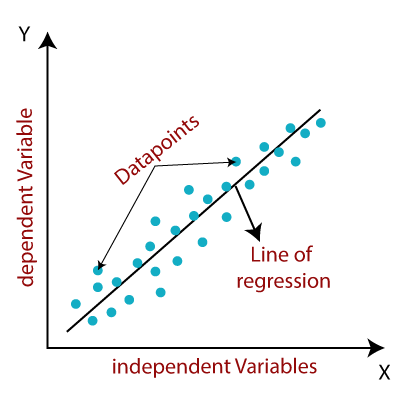
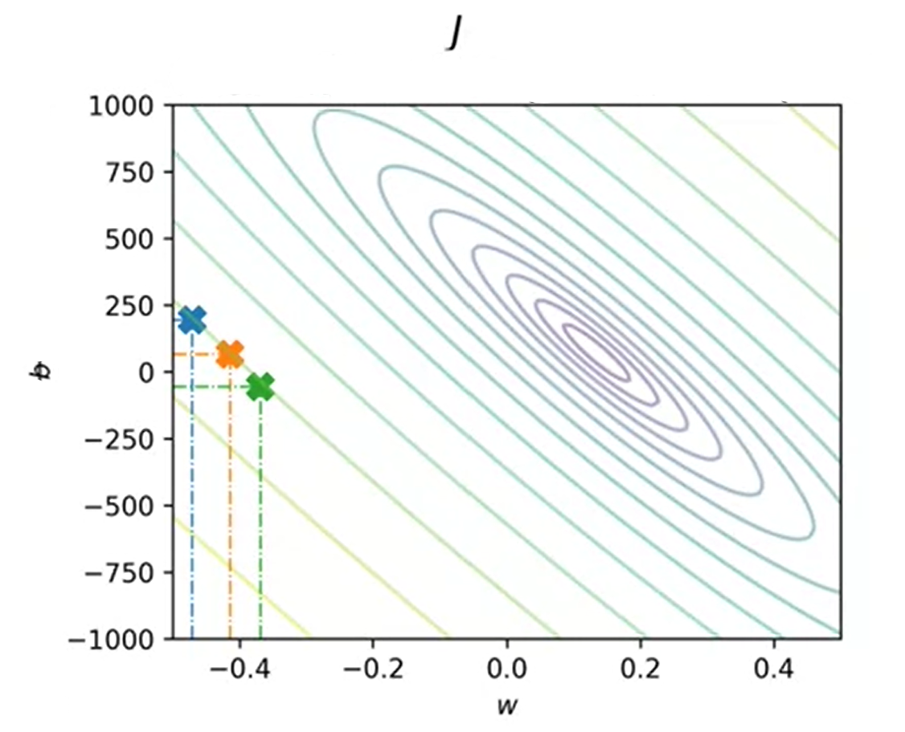

# Linear Regression

Some of the most common algorithms are regressions. A regression predicts a number from infinitely possible number outputs. Linear regressions fit a straight line to a dataset, while non-linear regressions fit a curved line to a dataset. Using only one input variable is called univariate linear regression, but models can have much more than just one. A practical example of linear regression is predicting home prices based on their square footage.



# Defining the Model

The function defining a linear regression model is represented as,

$$
f_{w,b}(x) = wx + b
$$

where $w$ represents the slope and $b$ the y-intercept of the line.

Once the line is fitted to the data, the same function definition is applied. The only difference is the output variable, which is now estimated based on the regression line. This predicted output and function model are defined as,

$$
\hat{y} = f_{w,b}(x^i) = wx^i + b
$$

# The Cost Function

## Finding the Cost Function

Since the slope ($w$) and y-intercept ($b$) dramatically influence the position and direction of the regression line, making sure it fits the data as accurately and precisely as possible is very important. Measuring how well a line fits the data is called finding the cost function, which is defined below. The error itself lies in the difference of the predicted output from the actual output $\hat{y}^i - y^i$.

$$
\sum_{i=1}^m(\hat{y}^i - y^i)^2
$$

It's important to compute this term for different training examples $i$ in the training set, up until the number of total training examples $m$. As the number of training examples increases, it can be more efficient to calculate the average square error, rather than the total square error. The cost function $J$, also called the squared error cost function, is defined as,

$$
J(w,b)=\frac{1}{2m}\sum_{i=1}^m(\hat{y}^i - y^i)^2
$$

The cost function most engineers use actually divides by $2m$, because it helps make calculations further into the process neater. Withholding this extra two is perfectly acceptable. While different applications use different types of cost functions, squared error cost functions are easily the most common type for regression problems.

To get a better sense of the parameters that are adjusted in the cost function, it can be written as,

$$
J(w,b)=\frac{1}{2m}\sum_{i=1}^m(f_{w,b}(x^i) - y^i)^2
$$

The only difference here is the predicted output $\hat{y}$ is represented as the function model $f_{w,b}(x^i)$. Because the function model contains the only parameters that can be adjusted (slope and y-intercept), this is the complete cost function definition.

## Optimizing the Cost Function

The goal of linear regression algorithms is to minimize the cost function as much as possible. This is done by comparing its output to the two parameters that affect its accuracy, $w$ and $b$.

$$
\underset{w,b}{\text{minimize}}\ J(w,b)
$$

$J$ can be plotted against both parameters individually, which results in 2D graphs for each. However, to get the full picture, they can also be plotted together in both 2D (contour) and 3D (surface) graphs.


Surface graph of the cost function; plotted against *w* and *b*.



Contour graph of the cost function; plotted against *w* and *b*.

# Multiple Feature Linear Regression

Adding more input features is a critical component of achieving accurate machine learning models. For example, consider the previous example of determining home prices by square footage. While this data can provide insight, it is probably not enough for practical use. More variables can be added, such as number of bedrooms and bathrooms, location, etc.

## Notation

When adding more input features, slight modifications to the notation are necessary,

- $x_j$ = $j^{th}$ feature
- $n$ = number of features
- $\vec{x}^{\,i}$ = features of $i^{th}$ training example
- $x_j^{\,i}$ = value of feature $j$ in $i^{th}$ training example

## Model

With the addition of multiple variables comes the necessary update to the model functions. Consider the following changes, where $n$ refers to the number of input features.

**Previous single variable model**

$$
f_{w,b}(x) = wx + b
$$

**Updated multivariable model**

$$
f_{w,b}(x) = w_1x_1 + \ldots + w_nx_n + b
$$

To simplify the notation, the multivariable model can be written with vectors. Notice how $b$ is not included in the vectors, as it is just a number and not a parameter.

$$
\vec{w} = \begin{bmatrix} w_1 & w_2 & w_3 & \dots & w_n \end{bmatrix}
$$

$$
\vec{x} = \begin{bmatrix} x_1 & x_2 & x_3 & \dots & x_n \end{bmatrix}
$$

$b$, however, is included in the complete model, which is described below.

$$
f_{\vec{w},b}(\vec{x}) = \vec{w} \cdot \vec{x} + b
$$

## Vectorization

Writing vectorized code is essential for turning these linear algebra equations into something a computer can read and process. It also so happens that GPUs are very efficient for running vectorized code. Consider the following example, where the parameters and features are transformed into code.

Notice how the linear algebra count is 1-indexed, while the Python code is 0-indexed. The Python code utilizes the widely used [NumPy](https://numpy.org/) package to implement linear algebra tools, among many others. Without NumPy, the dot product multiplication between $w$ and $x$ would have to be hardcoded, which could be especially problematic when running into a high value of $n$.

### Defining parameters and features

$$
n = 3
$$

$$
\vec{w} = \begin{bmatrix} w_1 & w_2 & w_3 \end{bmatrix}
$$

$b$ is a number.

$$
\vec{x} = \begin{bmatrix} x_1 & x_2 & x_3 \end{bmatrix}
$$

```python
w = np.array([1.0, 2.5, -3.3])
b = 4
x = np.array([10, 20, 30])
n = len(w)  # number of features
```

### Without vectorization (NumPy)

$$
f_{\vec{w},b}(\vec{x}) = \left( \sum_{j=1}^n w_j x_j \right) + b
$$

```python
f = 0
for j in range(n):  # 0 to n-1
    f += w[j] * x[j]
f += b
```

### With vectorization (NumPy)

$$
f_{\vec{w},b}(\vec{x}) = \vec{w} \cdot \vec{x} + b
$$

```python
f = np.dot(w, x) + b
```

The benefits of using vectorization are not only cleaner and simpler code, but that the performance is actually much faster. This is because NumPy uses parallel hardware in the computer.

Consider the example above. Without vectorization, the for loop runs linearly, by adding the product of $w$ and $x$ for each parameter $j$, step after step: `f += w[j] * x[j]`

However, with vectorization, the products for $w$ and $x$ for each parameter $j$ are computed in parallel. Using special hardware, these products are then added together to give the final result for $f$.

# Gradient Descent for Multiple Linear Regression

Utilizing gradient descent for multiple features follows a very similar process as multiple feature linear regression: adding vector notation. Consider the following pre-derived gradient descent algorithm, where multiple features $w$ are used for $m$ training examples in the dataset,

**Pre-derived gradient descent algorithm**

$$
w = w - \alpha \frac{\partial}{\partial w} J(\vec{w},b)
$$

$$
b = b - \alpha \frac{\partial}{\partial b} J(\vec{w},b)
$$

**Final gradient descent algorithm**

$$
w_j = w_j - \alpha \frac{1}{m} \sum_{i=1}^m \left(f_{\vec{w},b}(\vec{x}^{\,i}) - y^i\right)x_j^{(i)}
$$

$$
b = b - \alpha \frac{1}{m} \sum_{i=1}^m \left(f_{\vec{w},b}(\vec{x}^{\,i}) - y^i\right)
$$

simultaneously update $w_j$ (for $j = 1, \cdots, n$) and $b$

Notice how $b$ does not require utilizing $n$ features, because $b$ is a value that does not change based on the parameter being used. Also, the $x^i$ term in the equation for $w_j$ does not use vector notation, because that variable is dependent on the current feature $j$.

# Regularized Linear Regression

Since the cost function has now changed due to regularization, the gradient descent algorithm will need to be modified too; specifically, the derivative of the cost function. Given the regularized cost function and gradient descent functions,

$$
J(\vec{w},b) = \frac{1}{2m}\sum_{i=1}^m \left(f_{\vec{w},b}(\vec{x}^{\,i}) - y^i\right)^2 + \frac{\lambda}{2m} \sum_{j=1}^n w_j^2
$$

$$
w_j = w_j - \alpha \frac{\partial}{\partial w_j} J(\vec{w},b)
$$

$$
b = b - \alpha \frac{\partial}{\partial b} J(\vec{w},b)
$$

Fortunately, the necessary changes require only a small modification to $w_j$ in the gradient descent. Note $b$ is unaffected, because it is not a weighted parameter in the original regularization term.

$$
\frac{\partial}{\partial w_j} J(\vec{w},b) = \frac{1}{m} \sum_{i=1}^m \left(f_{\vec{w},b}(\vec{x}^{\,i}) - y^i\right)x_j^{(i)} + \frac{\lambda}{m} w_j
$$

$$
\frac{\partial}{\partial b} J(\vec{w},b) = \frac{1}{m} \sum_{i=1}^m \left(f_{\vec{w},b}(\vec{x}^{\,i}) - y^i\right)
$$

Combining the equations above, the complete gradient descent is formed,

**Complete gradient descent of regularized linear regression**

$$
w_j = w_j - \alpha \left[ \frac{1}{m} \sum_{i=1}^m \left[ \left(f_{\vec{w},b}(\vec{x}^{\,i}) - y^i\right)x_j^{(i)} \right] + \frac{\lambda}{m} w_j \right]
$$

$$
b = b - \alpha \frac{1}{m} \sum_{i=1}^m \left(f_{\vec{w},b}(\vec{x}^{\,i}) - y^i\right)
$$