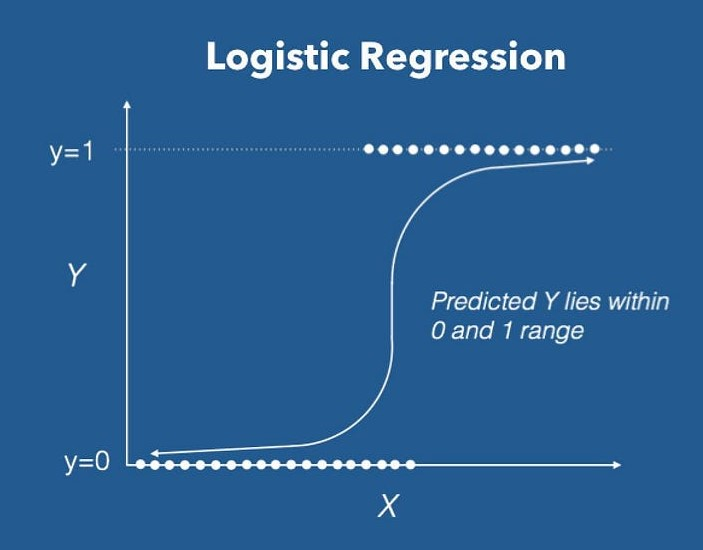
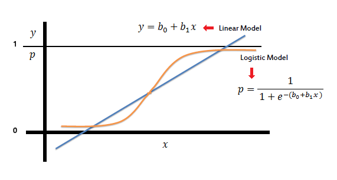

# Logistic Regression

Logistic regression is a means of fitting a line to data that fits into a binary classification (class). More specifically, $y$ can only be one of two values. Usually, these two values are represented as true (1) or false (0), and they are called the positive class and negative class, respectively. 

Even though the algorithm is called logistic regression, it is actually a classification problem and is only called this because of historical purposes. 

# Defining the Model

The main logistic function used for this algorithm is called the sigmoid function, and it fits an s-shaped curve to all values between 0 and 1. With every function, there is a threshold, which marks the breaking point for which data will be classified as positive or negative. 

Also, the data is normalized to be centers around 0 on the horizontal axis (renamed $z$), resulting in both positive and negative input values. Doing so allows the output values to always be between 0 and 1. 

Along with being an s-shaped curve, the sigmoid function also represent a probability $P$, which is a core trait of why it is so useful. When normalized to the origin, this equation gives the probability that an input value will be either 0 or 1. The sigmoid function is defined as follows,

$$
g(z) = \frac{1}{1+e^{-z}} = 1 - P(-z)
$$

$$
0 \lt g(z) \lt 1
$$

This probability can also be represented as,

$$
g(z) = log_e \left( \frac{P}{1-P} \right)
$$

Remember, the linear equation is defined as, $f_{\vec w,b} (\vec x) = \vec{w} \cdot \vec{x} + b$. Even though the linear equation and the sigmoid function have different shapes, they represent the same model of the line. This is best explained with the graph to the right. Therefore, the linear function can be set equal to the sigmoid function. 

$$
z = \vec w \cdot \vec x + b
$$

$$
g(z) = \frac{1}{1+e^{-z}} = \vec w \cdot \vec x + b
$$

Since $z$ and $\vec w \cdot \vec x + b$ represent the same input parameters, they can be substituted for each other, giving the final logistic regression algorithm.

### Final logistic regression algorithm

$$
f_{\vec w,b} (\vec x) = g(\vec{w} \cdot \vec{x} + b) = \frac{1}{1+e^{-(\vec w \cdot \vec x + b)}}
$$

Explaining why the function needs to be normalized to the origin of the horizontal axis and how the functions are actually derived can be confusing. [This video](https://www.youtube.com/watch?v=rrnfHG_wtII) does a great job of showing both. 

## Interpreting the Output

It is actually impossible for the algorithm to predict exactly 0 or 1, so the output is really a probability. Essentially, the algorithm is saying there is a $f_{\vec w, b}(\vec x)$ chance that $y = 1$. Conversely, it is also saying there is a $1 - f_{\vec w, b}(\vec x)$ chance that $y = 0$. This can be more formally written using probability notation,

$$
P(y = 0) + P(y = 1) = 1
$$

Research papers and other publications will often refer to this function in a more formal notation. The following equation reads as the probability that $y = 1$, given input $\vec x$, and parameters $\vec w, b$. 

$$
f_{\vec w, b}(\vec x) = P(y = 1|\vec x; \vec w, b)
$$

# The Decision Boundary

It is important to note that the decision boundary does not have to be set at 0.5 on the y-intercept, and adjusting the threshold is a common practice depending the application. For example, consider a tumor detection algorithm, where $g(z) \ge threshold$ marks a potential tumor. The threshold will probably want to be adjusted to a lower value, to reduce false positives and make sure no tumor is missed. For this application, marking malignment tumors as positive is worth the tradeoff.

The decision itself is represented as $\hat y$. It can be more formally written as,

$$
\text{Is} \ f_{\vec w, b}(\vec x) \ge threshold \ ? \\ \text{Yes: } \hat y = 1 \\ \text{No: } \hat y = 0
$$

Now, the next question to ask is - under what circumstances do these two cases happen?

$$
\text{When is } f_{\vec w, b}(\vec x) \ge threshold \\ g(z) \ge \ threshold \\ z \ge 0
$$

Since the function is normalized to the origin of the horizontal axis, this happens whenever $z$ is greater than or equal to 0. Moreover, since $z = \vec w \cdot \vec x + b$,

$$
\vec w \cdot \vec x + b \ge 0 \\ \hat y = 1
$$

$$
\vec w \cdot \vec x + b \lt 0 \\ \hat y = 0
$$

Notice how when $z = 0$, it is included in the positive boundary, even though this is actually the decision boundary itself. Since this is a binary classification problem, it must be added along with either the positive class or negative class. 

This logic applies exactly the same to non-linear (polynomial) functions, and is just a matter of fitting the function to 0 too. 

# The Cost Function

The cost function for logistic regression is similar to linear regression, however, it cannot use the squared error as the basis for the function. Instead, some adjustments need to be made. Recall the cost function for linear regression,

$$
J(\vec w,b)=\frac{1}{2m}\sum_{i=1}^m \underbrace{ \left( f_{\overrightarrow w,b}(\vec x^i) - y^i \right) ^2}
$$

In the case of logistic regression, the squared error can be treated as a Loss function $L$,

$$
L \left( f_{\vec w,b}(\vec x^ i), y^i \right)
$$

This function can also be written as,

### Semi-simplified Loss Function

$$
L\left( f_{\overrightarrow w,b} (\vec x^ i), y^i \right) = \left\{\begin{array}{lr}
        -log \left( f_{\overrightarrow w,b}( \vec x^ i ) \right) & \text{if } y^i=1\\
        -log \left( 1 - f_{\overrightarrow w,b}(\vec x^ i) \right) & \text{if } y^i = 0\\
        \end{array}\right\}
$$

The further the prediction is from the target, the higher the loss. The algorithm is highly incentivized to not have a high loss, because as the function approaches the wrong value (0 or 1), the loss approaches infinity. 

### Simplified Loss Function

$$
L\left( f_{\overrightarrow w,b} (\vec x^ i), y^i \right) = -y^i log \left(f_{\overrightarrow w,b} (\vec x^ i) \right) - ( 1-y^i)log \left( 1-f_{\overrightarrow w,b} (\vec x^ i) \right)
$$

Even though this equation looks much more complicated, keep in mind $y$ can only be either 0 or 1. Substituting for both these cases dramatically reduces the function back to the it’s more compact semi-simplified form above. This final notation expresses the function in one line and without separating out the two cases.

Using the loss function in conjunction with the original cost function, the pre-derived cost function can be defined as,

$$
J(\vec w,b)=\frac{1}{m}\sum_{i=1}^m \left[ L \left( f_{\overrightarrow w,b}(\vec x^i), y^i \right) \right]
$$

Substituting in the simplified loss function, and while doing a bit of arithmetic arranging, the final cost function is defined.

### Final Cost Function

$$
J(\vec w,b)=-\frac{1}{m}\sum_{i=1}^m \left[-y^i log \left(f_{\overrightarrow w,b} (\vec x^ i) \right) + ( 1-y^i)log \left( 1-f_{\overrightarrow w,b} (\vec x^ i) \right) \right]
$$

This particular cost function is derived from statistics, using the maximum likelihood principle. It has a convenient property that it is convex (single global minimum), which makes running a gradient descent intuitive. 

# Gradient Descent for Logistic Regression

Given the cost function $J$  and the gradient descent algorithms for $w$ and $b$,

$$
J(\vec w,b)=-\frac{1}{m}\sum_{i=1}^m \left[-y^{i} log \left(f_{\overrightarrow w,b} (\vec x^ i) \right) + ( 1-y^i)log \left( 1-f_{\overrightarrow w,b} (\vec x^ i) \right) \right]
$$

$$
w = w - \alpha \underbrace{\frac{\partial}{\partial w} J(\vec{w},b)}
$$

$$
b = b - \alpha \underbrace{\frac{\partial}{\partial b} J(\vec{w},b)}
$$

The derivatives of the cost function can be calculated as,

$$
\frac{\partial}{\partial w} J(\vec{w},b) = \frac{1}{m}\sum_{i=1}^m \left( f_{\overrightarrow w,b}(\vec x^i) - y^i \right)x_j^{(i)}
$$

$$
\frac{\partial}{\partial b} J(\vec{w},b) = \frac{1}{m}\sum_{i=1}^m \left( f_{\overrightarrow w,b}(\vec x^i) - y^i \right)
$$

Then, solving for both $w$ and $b$,

$$
w_j = w_j - \alpha \left[ \frac{1}{m}\sum_{i=1}^m \left( f_{\overrightarrow w,b}(\vec x^i) - y^i \right)x_j^{(i)} \right]
$$

$$
b = b - \alpha \left[ \frac{1}{m}\sum_{i=1}^m \left( f_{\overrightarrow w,b}(\vec x^i) - y^i \right) \right]
$$

Notice how these equations are exactly like the linear regression equations. However, the key difference lies within $f_{\overrightarrow w,b}(\vec x)$, where the function for the line changes. Even though they look the same, they are very different, due to the model function. 

# Regularized Logistic Regression

Applying regularization to logistic regression follows closely to linear regression. Considering the follow cost function equation for logistic regression, the only modification needed is to add the regularization term to the end of the equation,

$$
J(\vec w,b)=-\frac{1}{m}\sum_{i=1}^m \left[-y^{i} log \left(f_{\overrightarrow w,b} (\vec x^ i) \right) + ( 1-y^i)log \left( 1-f_{\overrightarrow w,b} (\vec x^ i) \right) \right] + \frac{\lambda}{2m} \sum_{j=1}^n w_j^2
$$

Moving onto the gradient descent algorithm, consider the following equations,

$$
w_j = w_j - \alpha \frac{\partial}{\partial w_j} J(\vec{w},b)
$$

$$
b = b - \alpha \frac{\partial}{\partial b} J(\vec{w},b)
$$

When solving for the derivatives, they result in the nearly the exact same equations as those found for linear regression. The only difference is the model function $f_{\vec w, b}(\vec x^i)$.

$$
\frac{\partial}{\partial w_j} J(\vec{w},b) = \frac{1}{m} \sum_{i=1}^m (f_{\vec{w},b}(\vec{x}^i) - y^i)x_j^{(i)} + \frac{\lambda}{m} w_j
$$

$$
\frac{\partial}{\partial b} J(\vec{w},b) = \frac{1}{m} \sum_{i=1}^m (f_{\vec{w},b}(\vec{x}^i) - y^i)
$$

Combining the equations above, the complete gradient descent is formed,

### Complete gradient descent of regularized logistic regression

$$
w_j = w_j - \alpha \left[ \frac{1}{m} \sum_{i=1}^m \left[ (f_{\vec{w},b}(\vec{x}^i) - y^i)x_j^{(i)} \right] + \frac{\lambda}{m} w_j \right]
$$

$$
b = b - \alpha \frac{1}{m} \sum_{i=1}^m \left( f_{\vec{w},b}\left( \vec{x}^i \right) - y^i \right)
$$