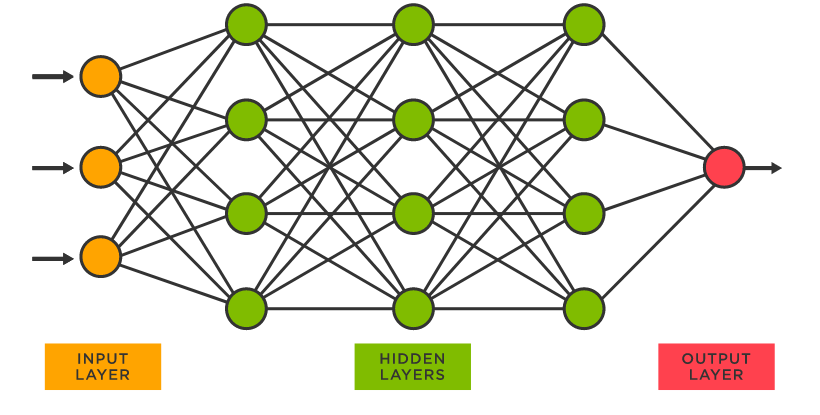
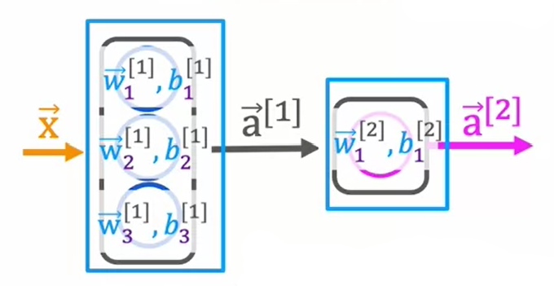

# Neural Networks

The original motive behind the creation of neural networks was to mimic the human brain. An artificial neural network is a collection of connected nodes, with each connection transmitting a signal to another node. 

Typically, nodes are aggregated into layers, with different layers performing different transformations. Signals travel from the input layer to the output layer (maybe passing through other layers in between), while possibly traversing the layers multiple times. The connections between nodes (edges) have weight, that adjusts as the learning proceeds. 



A neuron can be thought of as a singular algorithm. It takes an input layer, performs machine learning algorithms on it (activation $a$), then outputs a probability. Nodes in the middle layers and output layer are activations. A layer can have one or many nodes.

In actuality, it is hard to manually direct the relationships between nodes in each layer, so a neural network starts with edges for every possible connection. What makes the model so powerful is it automatically determines the optimal relationships between nodes. Layers build upon the relationships found in the previous layer, which allows them to take simple data (i.e. pixels in a photo) and detect entire real world objects (i.e. faces). The activations at each layer are higher level features.

](images/Untitled%201.png)

a neural network for facial recognition - [whitepaper](https://www.ijrte.org/wp-content/uploads/papers/v8i4/C6238098319.pdf)

# Defining the Model

Consider the following simple model for prediction, for $l$ layers in the model,

$$
\underset{\text{input layer}}{\vec x^{[0]}} \rightarrow \underset{\text{hidden layer}}{\vec a^{[1]}} \rightarrow \dots \rightarrow  \underset{\text{hidden layer}}{\vec a^{[l-1]}} \rightarrow \underset{\text{output layer}}{a^{[l]}}
$$

Each hidden layer $l$ contains a certain amount of neurons or activations $j$, and each of these takes an input, performs a [‣](https://app.notion.com/p/a55b93f722284e9ea110c6eb8ba6e49f?pvs=21) computation, then outputs an activation value $a$. Given a layer with $n$ neurons, the output for each neuron $\vec w_j, b_j$ can be described as,

$$
\vec w_j^{[l]}, b_j^{[l]} \rightarrow a_j^{[l]} = g \underbrace{(\vec w_j^{[l]} \cdot \vec x^{[l]} + b_j^{[l]})}
$$

For neural networks, $g(z)$ is the activation function. Here, logistic regression is being used, so the activation function is also the sigmoid function. *However, different types of functions can be used depending on the application*. This particular implementation is a neural network for binary classification.

$$
g(z) = \frac{1}{1+e^{-\vec w_j^{[l]} \cdot \vec x^{[l]} + b_j^{[l]}}}
$$

Note, when moving to the next layer, since the input is the same as the activation vector from the previous layer $\vec x^{[l]} = \vec a^{[l-1]}$, the relationship can be also be written as,

$$
a_j^{[l]} = g (\vec w_j^{[l]} \cdot \vec a^{[l-1]} + b_j^{[l]})
$$

Defining the layer index can be tedious, so including it in the equation is more for reference.

The output $a$ of each neuron in a layer is put into an activation vector $\vec a$, where it is fed into the next layer as an input. This output vector is described as,

$$
\vec a^{[l]} = \begin{bmatrix} a_1 && \dots && a_j\end{bmatrix}
$$

The process of moving through activation layers from input to output is called forward propagation. Likewise, there is also backward propagation (moving from output to input), which is used for learning.

When the activation values reach the final output layer, a scalar value is produced. At this point, there is an optional step to predict a logistic category,

$$
\text{is } a^l \ge threshold \text{ ?} \\ \hat y = 1 \\ \hat y = 0
$$

Since the output is a function of the original input, it is commonly referred to as $f(x)$.

Also, including the sigmoid activation in the final layer is not considered best practice. It would instead be accounted for in the loss, which improves numerical stability.

# Understanding the Model

## Visualizing the model

To better understand how the model pieces together its patterns, consider an example finding the optimal coffee roasting temperature and duration. Each graph is for a different unit or neuron in a layer, and it is the result of running a logistic regression and gradient descent. It’s worth noting the network learned these functions on its own through this process. The combination of these neurons gives a more complete picture of the entire boundary between good/bad coffee. When this is fed into the next layer, that next layer will have a more sophisticated building block to go off of.


## Forward Propagation in a Single Layer

Most machine learning frameworks like [TensorFlow](https://www.tensorflow.org/) and [PyTorch](https://pytorch.org/) handle forward propagation under the hood, so it is not necessary to implement this by hand. However, knowing how this fundamentally works is important. The following example uses Python and Numpy.

Consider the coffee roasting example above, with a simple model using 3 neurons for a single hidden layer.  The input $\vec x$ is a 1D array with two values, and for the purpose of brevity, $w$ and $b$ will be given starting values for each neuron. In the code below, values at specific neurons and layers is described as, $w_j^{[l]} =$  `w2_a`.



Given the follow input,

```python
x = np.array([200, 17])
```

---

The neurons for the first hidden layer are calculated as follows,

$$
a_1^{[1]} = g(\vec w_1^{[1]} \cdot \vec x + b_1^{[1]})
$$

```python
w1_1 = np.array([1, 2])
b1_1 = np.array([-1])
z1_1 = np.dot(w1_1, x) + b1_1
a1_1 = sigmoid(z1_1)
```

$$
a_3^{[1]} = g(\vec w_3^{[1]} \cdot \vec x + b_3^{[1]})
$$

```python
w1_13= np.array([5, -6])
b1_3 = np.array([2])
z1_3 = np.dot(w1_3, x) + b1_3
a1_3 = sigmoid(z1_3)
```

$$
a_2^{[1]} = g(\vec w_2^{[1]} \cdot \vec x + b_2^{[1]})
$$

```python
w1_12= np.array([-3, 4])
b1_2 = np.array([1])
z1_2 = np.dot(w1_2, x) + b1_2
a1_2 = sigmoid(z1_2)
```

---

After running the sigmoid function for each neuron, they can be added to the resulting activation array,

```python
a1 = np.array([a1_1, a1_2, a1_3])
```

This activation array is then fed into the next layer, which is also the output layer, and the process is complete. Since the output layer is a single neuron, `a2_1` will result in a single value. 

$$
a_1^{[2]} = g(\vec w_1^{[2]} \cdot \vec a^{[1]} + b_1^{[2]})
$$

```python
w2_1 = np.array([-7, 8, 9])
b2_1 = np.array([3])
z2_1 = np.dot(w2_1, a1) + b2_1
a2_1 = sigmoid(z2_1)
```

# Training the Model with TensorFlow

The following code is an example of a neural network trained with TensorFlow. Note that many of the concepts modeled by hand have been completely automated by the framework. The `Sequential` and `Dense` classes allow for easy creation of layers, where `units` specifies the number of neurons and `activation` defines the activation function, for each layer. Moreover, TensorFlow also comes with prebuilt `loss` functions, which can be imported. The number of steps gradient descent will run is defined with `epochs`.

```python
import tensorflow as tf
from tensorflow.keras import Sequential
from tensorflow.keras.laters import Dense

model = Sequention ([
	Dense(units=25, activation='sigmoid'),
	Dense(units=15, activation='sigmoid'),
	Dense(units=1, activation='sigmoid'),
])

from tensorflow.keras.losses import BinaryCrossentropy

model.compile(loss=BinaryCrossentropy())
model.fit(X, Y, epochs=100)
```

# Activation Functions

Often times, activation functions need to be mixed within a neural network. Some properties (affordability of a product) can be defined using binary classification - it’s either affordable or it’s not. However, other properties (awareness of a product) are better off with the different activation function - awareness can be measured on a sliding scale, for example.

Some of the most common activation functions are listed below:

### Linear

$y = 0/1$

$$
g(z) = z
$$


### Sigmoid

$y = +/-$

$$
g(z) = \frac{1}{1+e^{-z}}
$$


### Rectified Linear Unit (ReLU)

$y = 0/+$

$$
g(z) = max(0, z)
$$


## Choosing an Activation Function

Usually the most straightforward layer to choose an activation function $g(z)$ is the output layer, as it only exports a single value and is the desired result of the model. When making a choice, it is important to look at what range of values the output should fall between. For example, if predicting a home price, homes do not have negative values, so any that do so should be treated as 0. The rectified linear unit function is the best choice here.

The range of outputs for each of the common activations listed above are as follows,

- Linear: $y = 0/1$
- Sigmoid: $y = +/-$
- Rectified Linear Unit (ReLU): $y = 0/+$

The hidden layers can be a little less obvious. That being said, ReLU is by far the most common choice. Sigmoid functions used to be utilized quite commonly, but now they are used hardly ever. The exception to this is the output layer of a binary classification problem.

There are several reasons for this, the first being ReLU is simply faster to compute (just based on the function structures themselves). The second, and more important reason, is gradient descent often runs much slower on the sigmoid function. This is because gradient descent runs much slower on flatter parts of the curve. The sigmoid function has two of these; asymptotes approaching 0 and 1. ReLU has one, which are all values less than or equal to 0.  

On another note, if a neural networks uses a linear activation function for every layer, regardless of how many layers are used, it is actually no different than running linear regression and defeats the purpose of the neural network. Likewise, using a linear function for all hidden layers and a sigmoid function for the output layer is not different than running logistic regression. 

<aside>
💡 A broad rule is to not use linear activations in hidden layers.

</aside>

# Multiclass Classification

Up until this point, the examples have been using binary classification to describe many of the problems. Multiclass classification extends this to include more than two possible outputs. For example, instead of predicting just a 0 or 1 in photo of handwriting, the model can predict other numerical numbers (i.e. 2 through 9).

In a binary classification, the prediction is defined as,

$$
P(y=1|\vec x)
$$

With multiclass classification, the prediction is defined as the following, where $n$ denotes the number of classifications.

$$
P(y=1|\vec x) \\ P(y = 2| \vec x) \\ \cdots \\ P(y = n | \vec x)
$$

## SoftMax Regression

The SoftMax regression algorithm is a generalization of logistic regression, and it applies binary classification to a multiclass context. In addition to providing probabilities for each of the classes, it is able to fit a decision boundary around all of the classifications. Describing how the algorithm works can is best done through example. 


Consider the example pictured above, with 4 types of classification. The regression algorithm for each of the four classifications (possible outputs) is defined first. Then, the activation function (output) is defined for each classification. Remember that the activation function is the same as the probability.

$$
z_1 = \vec w_1 \cdot \vec x + b_1
$$

$$
a_1 = \frac{e^{z_1}}{e^{z_1}+e^{z_2}+e^{z_3}+e^{z_4}} = P(y=1|\vec x)
$$

$$
z_2 = \vec w_2 \cdot \vec x + b_2
$$

$$
a_2 = \frac{e^{z_2}}{e^{z_1}+e^{z_2}+e^{z_3}+e^{z_4}} = P(y=2|\vec x)
$$

$$
z_3 = \vec w_3 \cdot \vec x + b_3
$$

$$
a_3 = \frac{e^{z_3}}{e^{z_1}+e^{z_2}+e^{z_3}+e^{z_4}} = P(y=3|\vec x)
$$

$$
z_4 = \vec w_4 \cdot \vec x + b_4
$$

$$
a_4 = \frac{e^{z_4}}{e^{z_1}+e^{z_2}+e^{z_3}+e^{z_4}} = P(y=4|\vec x)
$$

No matter how many classifications there are, the resulting sum of all activations $a$ produced will result in 1. 

$$
a_1 + a_2 + \ldots + a_N = 1
$$

### General SoftMax Regression Function

For $N$ possible classifications (outputs), where $j = 1, ..., N$,

$$
z_j = \vec w_j \cdot \vec x + b_j
$$

$$
a_j = \frac{e^{z_j}}{\sum^N_{k=1}e^{z_k}}=P(y=j|\vec x)
$$

## Cost Function

Like logistic regression, the cost function for multiclass regression uses the loss function. Consider the loss function for logistic regression,

$$
loss = -y \log a_1 - (1-y) \log(1 - a_1)
$$

The equation above is can be simplified for multiple classes, due to some mathematics and probability. This type of loss is called crossentropy loss, and is as follows,

### Crossentropy Loss

$$
loss(a_1, \ldots , a_N, y) = \left\{\begin{array}{lr}
        -\log a_1 & &\text{if }y=1\\
        -\log a_2 & &\text{if } y = 0\\  & \vdots \\                                    -\log a_N & &\text{if } y = N
        \end{array}\right\}
$$

## Implementing SoftMax with TensorFlow

```python
import tensorflow as tf
from tensorflow.keras import Sequential
from tensorflow.keras.layer import Dense

model = Sequential([
	Dense(units=25, activation='relu'),
	Dense(units=15, activation='relu'),
	Dense(units=10, activation='softmax'),
])

from tensorflow.keras.losses import SparseCategoricalCrossentropy

model.compile(loss=SparseCategoricalCrossentropy())
```

# Improving SoftMax

Because computers have finite memory, values stored in variables have small numerical roundoff errors. In order to improve this, instead of calculating the activation value $a$ in one step, storing it in a variable, then calculating the loss with it in the next - all of this is done in one operation. Consider the softmax regression formula below,

$$
(a_1, \ldots, a_{N}) = g(z_1 \ldots, z_{N})
$$

$$
\text{Loss} = L(\vec a, y) = \left\{\begin{array}{lr}
        -\log a_1 & &\text{if }y=1\\
          & \vdots \\                                    -\log a_N & &\text{if } y = N
        \end{array}\right\}
$$

Adding $g(z)$ to the loss function helps make the function more accurate,

### More Accurate SoftMax Regression

$$
\text{Loss} = L(\vec a, y) = \left\{\begin{array}{lr}
        -\log \frac{e^{z_1}}{e^{z_1} + \dots + e^{z_{N}}} & &\text{if }y=1\\
          & \vdots \\                                    -\log \frac{e^{z_N}}{e^{z_1} + \dots + e^{z_N}} & &\text{if } y = N
        \end{array}\right\}
$$

Making these changes to implementations in TensorFlow is pretty straightforward. Consider the original loss function definition,

```python
model = Sequential([
	Dense(units=25, activation='relu'),
	Dense(units=15, activation='relu'),
	Dense(units=20, activation='softmax'),
])
model.compile(loss=SparseCategoricalCrossEntropy())
```

Adding the `from_logits` to the loss function basically specifies the output activation is linear rather than softmax. Changing the output’s activation function from softmax to linear in the `Dense` function is also necessary. Because the output of the compile step is now $g(z)$ instead of $a$, it is necessary to convert these to activation values. This is done with built in TensorFlow functions as well. 

Notice how the softmax function is used in the final prediction in the code. This is because this example is using linear regression. If the model was using another output function, such as logistic regression, then sigmoid would be substituted in place. 

### More Accurate SoftMax Regression

```python
model = Sequential([
	Dense(units=25, activation='relu'),
	Dense(units=15, activation='relu'),
	Dense(units=20, activation='linear'),
])
model.compile(loss=SparseCategoricalCrossEntropy(from_logits=True))
#...
logits = model(X)
f_x = tf.nn.softmax(logits)
```

Numerical roundoff errors are not that bad, however, it is recommended to use the more accurate versions in practice. 

# Advanced Optimizations

## Adam Algorithm

One optimization to help increase the efficiency of deep learning problems deals with the learning rate $\alpha$ in the gradient descent. It is possible to automatically recognize when the learning rate (thus each step) is too small or too big, and the rate can be adjusted accordingly. This modification is called the Adam Algorithm (Adaptive Moment estimation), and it handles both cases.

The algorithm works by not using one learning rate across all parameters $w$. Every parameter, including $b$, has its own learning rate.

$$
w_1 = w_1 - \alpha_1 \frac{\partial}{\partial w_1} J(\vec w, b) \\ \vdots \\ w_n = w_n - \alpha_n \frac{\partial}{\partial w_n} J(\vec w, b) \\ b = b - \alpha_{n+1} \frac{\partial}{\partial b} J(\vec w, b)
$$

The intuition behind this concept is if $w_j$ or $b$ keeps moving in the same direction (underfitted), $\alpha_j$ should be increased. Conversely, if $w_j$ or $b$ keeps oscillating (overfitted), $\alpha_j$ should be reduced. The details of how this works are a bit complicated, but in simple terms, it keeps track of the moving average of the first and second moment of the gradient. Thus, it can give an unscaled direct estimation of the parameter’s updates. For a more detailed look, see the [Complete Guide to Adam Optimization](https://towardsdatascience.com/complete-guide-to-adam-optimization-1e5f29532c3d).

Implementing the Adam algorithm in TensorFlow is straightforward, and requires a small modification to compiling the model. An initial learning rate must be provided.

```python
model.compile(optimizer=tf.keras.optimizers.Adam(learning_rate=1e-3), loss)
```

## Additional Layer Types

So far, the dense layer has been implemented for all layers, because each neuron output has been a function of *all* the activation outputs of the previous layer. One other layer type is the Convolutional Layer, in which each neuron only looks at part of the previous layer’s inputs. The first benefit is faster computation, as there are simply less calculations needed. The second advantage is the model needs less training data, thus, it is less prone to overfitting. 

Moreover, a neural network with multiple convolutional layers is called a convolutional neural network. This is useful when the neural network only needs to look at specific “windows” in a set of data, such as analyzing pictures in an image or an EKG graph.