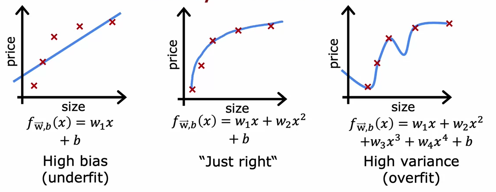

# Practical Machine Learning

# Debugging a Learning Algorithm

Consider a simple example, say, a regularized linear regression on housing prices; but it makes unacceptably large errors in predictions. What could be tried next?

- Get more training examples
- Try smaller sets of features
- Get additional features
- Try adding polynomial features ($x^2, x^3,$ etc.)
- Increase/decrease the regularized parameter $\lambda$

Some of these will be more impactful, while others will be less. The key to making a good model is to know where to make these adjustments. Luckily, machine learning has diagnostic techniques (tests) to gain insight into what is and isn’t working. They can often take time to implement, but the rewards can be very fulfilling.

# Evaluating a Model

Sometimes it is useful to break up the training data set into two smaller chunks; one still being the training set (70-80% of data), while the other is now a test set (30-20% of data). Consider the following equations, detailing the notations for these two sets of data,

### Training Set

$$
m_{train} = \text{no. training examples} \\ (x^1, y^1) \\ \vdots \\ (x^{m_{train}}, y^{m_{train}})
$$

### Test Set

$$
m_{test} = \text{no. test examples} \\ (x^1_{test}, y^1_{test}) \\ \vdots \\ (x_{test}^{(m_{train})}, y_{test}^{(m_{train})})
$$

The purpose of this is to minimize the cost function for both sets, but with a slight modification - both the train and test data do not include regularization in the cost function. 

## Linear Regression

Below is the original cost function minimization algorithm for linear regression, 

$$
J(\vec w,b)={\frac{1}{2m}\sum_{i=1}^{m}(f_{\vec w,b}(\vec x^i) - y^i)^2} + \frac{\lambda}{2m} \sum_{j=1}^n w_j^2
$$

Now consider the test error and training error without regularization,

$$
J_{test}(\vec w,b)={\frac{1}{2m_{test}}\sum_{i=1}^{m_{test}}(f_{\vec w,b}(\vec x^{(i)}_{test}) - y^{(i)}_{test})^2}
$$

$$
J_{train}(\vec w,b)={\frac{1}{2m_{train}}\sum_{i=1}^{m_{train}}(f_{\vec w,b}(\vec x^{(i)}_{train}) - y^{(i)}_{train})^2}
$$

Depending on the results between the two, certain inferences can be made about the model function. For example, if $J_{train}(\vec w, b)$ is too low and $J_{test}(\vec w, b)$ is too high, then even though the model does a good job fitting the data, it does not generalize to new data well. 

## Logistic Regression

Extending this concept to logistic regression and classification problems, while the logic described above can be applied to the logistic cost function, it is actually more effective to use an alternative technique. Instead, the fraction of the test set and the fraction of the train set that the algorithm has misclassified $\hat y \neq y$ should be calculated. 

$$
\text{count } \hat y \neq y \\ J_{test}(\vec w, b) = \text{ the fraction of the test set that has been misclassified} \\ J_{train}(\vec w, b) = \text{ the fraction of the train set that has been misclassified}
$$

# Choosing a Model

In general, once parameters $\vec w, b$ are fit to the training set, the training error $J_{train}(\vec w, b)$ is likely lower than the actual generalization error. The generalization error is the error when applied to new data. So in other words, a model might have a low cost function after training, but when it tries new data, the cost is not nearly as low anymore.

One of the first decisions made into a model function is what degrees of power the function should have. For example, it could be a linear function with max power $x$, or it could be a polynomial function with $x^2, x^3, x^4,$ etc. Now, a common idea would be to test each of the orders and compute the cost $J_{test}$ for each of these degrees, then pick the function and degree with the lowest cost. While this may seem like it would work well, it actually suffers the same problem mentioned earlier, and the function is likely to not generalize well to new data.

## Cross Validation

Instead a new technique is used, where the data is split into three subsets: the training set (60% of data), the cross validation set (20% of data), and the test set (20% of data).

### Training Set

$$
m_{train} = \text{no. train} \\ (x^1, y^1) \\ \vdots \\ (x^{m_{train}}, y^{m_{train}})
$$

### Cross Validation Set

$$
m_{cv} = \text{no. cv} \\ (x^1_{cv}, y^1_{cv}) \\ \vdots \\ (x_{cv}^{(m_{cv})}, y_{cv}^{(m_{cv})})
$$

### Test Set

$$
m_{test} = \text{no. test} \\ (x^1_{test}, y^1_{test}) \\ \vdots \\ (x_{test}^{(m_{train})}, y_{test}^{(m_{train})})
$$

Like the training and test error equations, the cross validation error does not use the regularization parameter,

$$
J_{cv}(\vec w,b)={\frac{1}{2m_{cv}}\sum_{i=1}^{m_{cv}}(f_{\vec w,b}(\vec x^{(i)}_{cv}) - y^{(i)}_{cv})^2}
$$

The purpose of adding this new training set is to use it as the comparison for checking the various polynomial powers, before confirming it with the test set. So the cross validation set is used to compute the costs for the various function powers $J_{cv}$ and the lowest cost is chosen out of them. Then, the generalization error $J_{test}$ can be estimated with the test set, which will have avoided any biases, because they are untouched sets of data. 

This model selection also works for other types of machine learning algorithms, such as choosing a neural network architecture. Instead of changing the degree of polynomials in the function (which can still be changed too), the amount of layers and units within those layers can be varied. 

# Bias and Variance

Looking at bias and variance usually leads to increasing the efficiency and effectiveness of a model. Remember, bias refers to underfitting a model, while variance refers to overfitting a model. 

Often times, especially with complex functions, it is hard or impossible to just look at the plot to determine if has high bias or variance. Fortunately, it is possible to look at the results of the cost function for the different data sets (training, cross validation, testing) to make inferences.

If the cost function has a high cost function for the training data $J_{train}$, then it most likely has high bias. Conversely, if the cost function is low, it is either just right or has high variance. To determine if it has high variance for sure, look at the cost function for the cross validation data $J_{cv}$. If this is also high, than there is a strong possibility the model has high variance.

This also extends to bias, so if a model has a high cost function for the cross validation data $J_{cv}$, along with the training data $J_{train}$, it most likely has high bias. Moreover, if a model has low cost functions for both training and cross validation, it is probably a well fitting model function.

## Effects of Regularization on Bias and Variance

When the regularization parameter $\lambda$ is very high, it diminishes the effects of the loss function, thus, it essentially makes the model function equal to the single parameter $b$:  $f_{\vec w, b}(\vec x) \approx b$. Consider the following equation for linear regression to get a better idea of why this is the case. When the regularization is much higher than the loss, it doesn’t matter how great or little the loss function is, so all parameters $\vec w$ are nearly worthless.

$$
J(\vec w,b)={\frac{1}{2m}\sum_{i=1}^m(f_{\vec w,b}(\vec x^i) - y^i)^2} + \frac{\lambda}{2m} \sum_{j=1}^n w_j^2
$$

Because the function has been stripped down to essentially one parameter, it will be underfit, thus having high bias. Conversely, when the regularization parameter is 0, it will have no affect on loss, and it can possibly lead to overfitting the function and causing high variance. 

When looking to find the sweet spot for the value of $\lambda$, the cross validation set can give some useful insight. The process is almost exactly like finding the degree of polynomial earlier. A set of values for lambda are substituted into the model function, and each are trained on the model with the training data. The cost functions are computed with the cross validation data, which are then compared to find the most optimal (lowest). 

## Establishing a Baseline Performance

When looking at cost function values, it is important to have a baseline to compare with, so there is context and perspective around the values. For example, given a training error of 10.8% and a cross validation error of 14.8%, these values may look high initially. However, the application is for speech recognition, and the human error rate is 15% due to its difficulty by nature. This model actually performed better than a human and the results are not nearly as bad as they originally look. 

In order to estimate the level of error that the model should reasonably hope to get to, human level performance is often a good benchmark. In addition, measuring against competing algorithms can also be helpful, as the model might not be good, but it’s better than anything that currently exists. If the cost function for the training data is higher than these baseline, it often indicates high bias.

## Effects of Training Data Size

If a learning algorithm suffers from high bias, getting more training data will not (by itself) help much. This is because the function does not inherently fit the data well due to underfitting, so adjustments must be made to the model itself. On the other hand, increasing the training data size can greatly help in cases of high variance. This is because the model function is overfit and will adjust to the new data being provided. 

## Debugging the Learning Algorithm

Revisiting the list of techniques to debug an algorithm, mentioned at the beginning of this page, they all are a way to fix high bias or variance:

- Get more training examples (fixes high variance)
- Try smaller sets of features (fixes high variance)
- Get additional features (fixes high bias)
- Try adding polynomial features ($x^2, x^3,$ etc.) (fixes high bias)
- Increase the regularized parameter $\lambda$ (fixes high bias)
- Decrease the regularized parameter $\lambda$ (fixes high variance)

Note the fixes for high bias usually involve changes to the model function by making it more complex. 

These are just a few examples, and while understanding bias and variance is fairly straightforward, it is extremely hard to master. Tweaking these parameters and truly understanding the model is one of the most complex and important aspects of machine learning. 

## Neural Networks

One of the reasons neural networks have taken off, is their requirement for lots of data, which in turn helps decrease bias and variance. It turns out large neural networks (lots of hidden layers and/or units per layer) are low bias machines by nature. In conjunction with feeding the network more data to decrease variance, these two adjustments make for a powerful way to avoid the typical “bias - variance tradeoff”: These changes are independent of the model function.

There is the risk that a neural network can be too large, but this can usually be avoided as long as regularization is chosen appropriately. If this is done properly, increasing the size is usually not a problem. However, the caveat is that a bigger neural network is more computationally expensive and takes longer to compute. 

# The Development Process

Machine learning is an iterative process, often requiring many cycles of adjustments. The first step is to choose the architecture of the model and data, making sure both are applicable to the problem at hand. Next, the model is trained, which is then followed by diagnostics (bias, variance, error analysis). From here, one cycle has been completed, and the loop starts again with adjustments to the architecture. Often times, the changes in architecture are related to the training data, such as collecting more data. 

## Error Analysis

Manually examining data that results in an error can be a strong option for gaining insight into a model. For example, a human might be able to notice patterns the model might not have picked up on. Classifying and counting these patterns is also useful for assessing impact and prioritization. It’s also worth noting that it’s ok if these patterns overlap, so they do not have to be mutually exclusive. 

Taking these patterns back to the beginning of the process loop, and combining them with architecture decisions (i.e. what parameters to use) is an important step into refining a more promising model. Now, this error analysis can be easier for use cases with lots of human intuition (i.e. home prices) but can be much more complex and harder to analyze in different applications (i.e. optimizing compilers). 

## Adding Data

Adding more data of “everything” is usually a useful endeavor. Though, adding more data of the types where error analysis has indicated it might help can possibly be more efficient. Error analysis can give insight into what specific data is lacking, which is why it is a very powerful tool for analyzing data and determining what additions need to be made. Of course, this can speed up the development process, as collecting and processing data can be very time consuming, and only working with a subset of that will lead to faster results.

### Data Augmentation

Beyond getting brand new training examples $(x, y)$, another technique is data augmentation. This involves modifying an existing training example to create a new training example. 

For example, say a model is being trained on images. Instead of finding a brand new image, one could rotate the image, enlarge or shrink it, change the color balance, increase or decrease contrast, etc. With image detection in particular, adding a grid to an image then warping it to create many other examples is very efficient.

Finding creative ways to augment data, especially when the computer can do most of the work, is key to leveraging the data already collected. Note, it’s important the augmentation should be representative of the type of distortion in the test set. Adding purely random/meaningless noise to the data does not usually help. 

### Data Synthesis

One other way to gaining new training examples is with data synthesis, which is using artificial data inputs to create a new training example. Depending on how synthetic the changes are, much of this overlaps with data augmentation. For example, consider the image recognition example mentioned above. One way to create synthetic data is to open up a text editor and use many different fonts. 

## Transfer Learning

Transfer learning is the process of using another neural network model, often times from a very different application to one’s own, to help train another neural network. Essentially, this other model is reused as the starting point for a second.

The basic steps for transfer learning are quite simple:

1. Download neural network parameters pretrained on a large dataset with the same input type (e.g. images, audio, text, etc.) as the one being developed.
2. Further train (fine tune) this network on the new data in possession.

Two possible ways of performing transfer learning are as follows:

1. Only train the output layers parameters, while leaving the other parameters of the model fixed.
2. Train all parameters of the model, including the output layers, as well as earlier layers.

# Skewed Datasets

Datasets are not always distributed evenly, and when this distribution is asymmetrical, the data is considered skewed. Working with skewed data can lead to false conclusions about a model’s effectiveness, if it is not handled properly. An example of a skewed dataset is a rare disease classification, where 0.5% of patients have this rare disease in the dataset. If the model has a 1% error, this looks good at first, but it is actually near useless, as it has a higher error than blindly saying everyone doesn’t have the disease.

## Precision/Recall

On problems with skewed datasets, another error technique is used, rather than just classification error. This technique is called precision/recall. This technique involves classifying the output data $\hat y$ into true/false and positive/negative categories, based on whether it matched the predicted output $y$. Then, the precision and recall of the data is calculated. In this example of the rare disease, $y=1$ is the presence of the disease.

### Precision

$$
\frac{\text{True pos}}{\text{predicted pos}} = \frac{\text{True pos}}{\text{True pos } + \text{False pos}}
$$

For this example, of all patients where the model predicted $y=1$, what fraction actually have the rare disease?

### Recall

$$
\frac{\text{True pos}}{\text{actual pos}} = \frac{\text{True pos}}{\text{True pos } + \text{False neg}}
$$

For this example, of all the patients that actually have the rare disease, what fraction were correctly detected as having it?

## Trading Off Precision and Recall

Precision and recall are used in conjunction with the threshold set for the learning algorithm’s cost function. Instead of setting this threshold at 0.5, it can be increased or decreased, depending on how strict or loose the application needs to be. In the example above, setting a high threshold, say 0.8, will lead to higher precision (only predict $y=1$ if very confident). Conversely, this will lead to lower recall. 

On the other hand, say the application is more concerned with avoiding missing too many cases of the rare disease (when in doubt predict $y=1$). Lowering the threshold will lower the precision and increase the recall. 

There is an inherent tradeoff between precision and recall, and finding this balance according to the application is important. Note in this example, there was no cross validation used, so the balance is found by manually adjusting the threshold. 

## F1 Score

Often times, it is hard to look at precision and recall numbers for various algorithms and compare them intuitively. Thankfully, there is a technique to automatically adjust precision and recall, which is called the F1 score. It works by combining the two values into one value (score) and giving extra attention to the the lower value. It turns out, if an algorithm has very low precision or very low recall, it is probably not useful. 

$$
F_1 score = 2 \frac{PR}{P + R}
$$

In mathematics, this equation is also called the Harmonic mean, and it is a way of taking an average, while emphasizing the smaller values. 

# Ethics

Unfortunately, machine learning can be used for unethical practices, such as fraud, deep fakes, bias against certain demographics, etc. Often times, models have unintended consequences, resulting in unethical behavior. An example of this is a model for bank loans that unintentionally  discriminated against certain populations. Creating an ethical model involves thoroughly inspecting and understanding the data. Before this, though, there are ways to prepare for creating the model that can help reduce bias and unethical results:

- Get a diverse team to brainstorm things that may go wrong, with an emphasis on possible harm to vulnerable groups.
- Carry out literature search on standard/guidelines in the industry the model is being applied.
- After training the model but before deploying it, audit the system against possible harm.
- Develop a mitigation plan (if applicable), such as a rollback to a previous model. After deployment, monitor for possible harm.