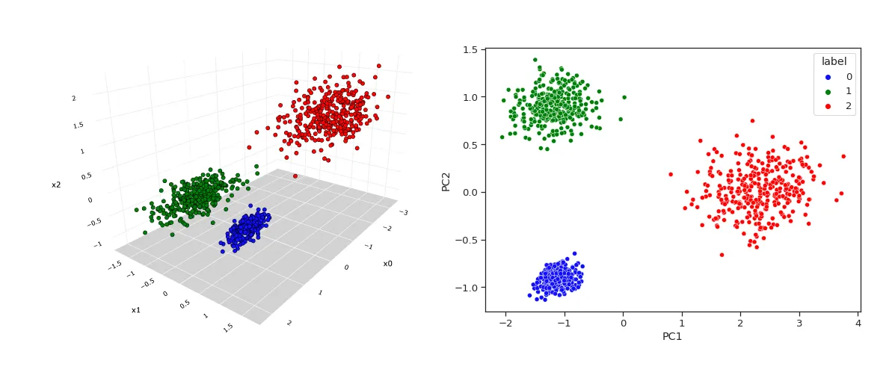
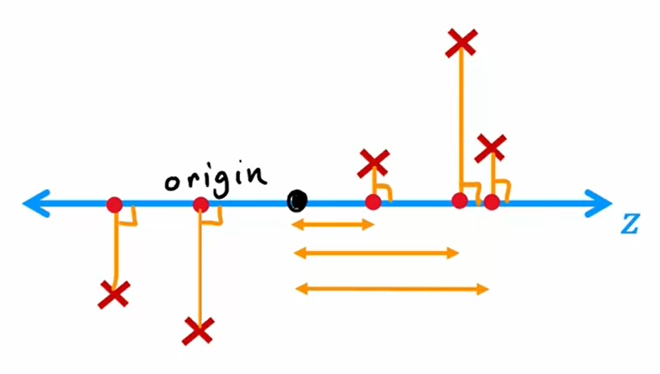

# Principle Component Analysis

Principle component analysis (PCA) is an unsupervised machine learning algorithm, which is commonly used for data visualization. Specifically, if a model has a dataset with a lot of features, it is near impossible to plot this data after 5-10 dimensions. The algorithm reduces these features to just a few, so they can be easily plotted and visualized.



In addition to data visualization, PCA is also sometimes used for data compression (though this is being becoming less often with data storage rising). It has also been used for speeding up training of a supervised learning model (typically support vector machines), though this has gotten less effective over time too.

# Reducing the Number of Features

To start reducing the number of features, the first thing that can be done is combining or eliminating redundant features. Say a dataset has a feature that is more or less relatively consistent, it may be worth taking out all together. For example, using car dimensions, the width of a car between models is relatively the same when compared to the length. Car width ends up being not as important for most applications anyways. Eliminating the width altogether may be worthwhile here. Additionally, the width and length could be combined into one area feature, if the width of the car is still important.

What if instead of combining the features together, a third axis could be created, based on the line function of the two features plotted against each other? This new axis is a function of the two features, and its accuracy depends on how well the axis fits the data. By continuously taking this third axis of two features plotted against each other, all features can be reduced to a smaller amount of features.

# Defining the Algorithm

The key to the PCA algorithm is to pick the best new axis at each feature reduction step. When given two features, the first task is to preprocess them. This is done by normalizing the features to have a zero mean and scaling the features relative to each other. These actions center the data points around the origin and ensure the value ranges aren’t too far apart, respectively.

## Projecting data points

After preprocessing the data, the next step is to project each data point onto a new (z) axis. The term “project” means the original points are being translated to new points on the z-axis via a perpendicular line. This new axis is called the principle component, and the key to its effectiveness is the variance of the projected data points on it.



If the data points are spread out, the axis fits well. Conversely, if they are all clumped together, the axis does not fit well. Variance is important because it means the data has still captured its information.  

After a new z-axis has been defined, which is in the form of a two-unit vector $(z_1, z_2)$, coordinates are projected onto the axis by first taking a dot product of the coordinate vector $(x_1, x_2)$ and the axis vector.

$$
z = \begin{bmatrix} x_1 \\ x_2 \end{bmatrix} \cdot \begin{bmatrix} z_1 \\ z_2 \end{bmatrix}
$$

This dot product results in a scaler value, which is a distance value. Since the z-axis is a vector from the origin, the distance value is translated onto the vector to give the final coordinate points.

$$
coordinates = z \cdot \begin{bmatrix} z_1 & z_2 \end{bmatrix}
$$

## Observations and misconceptions

As new axes are created in subsequent iterations, they actually end up always being perpendicular to all axes before it.


Additionally, it is important to note PCA is not linear regression, even though they may look similar. Since both algorithms try to minimize the distance between the coordinates and the axis, the key difference is the axis the distance is minimized from. Linear regression minimizes distance along the y-axis, while PCA always uses the perpendicular line.

Also, linear regression only has two features, while PCA can have many features, and multiple axis are used to retain the information (variance). They are both very different algorithms used for different purposes, and it becomes more apparent as the PCA algorithm has more features.

## Approximating original data

Since the PCA algorithm works in linear steps and utilizes a simple vector dot product, it is actually possible to reverse engineer original data by reversing the algorithm. Given a distance value $z$ (it is important to have this value first), the old coordinates can be projected by the following equation,

$$
\begin{bmatrix} x_1 \\ x_2 \end{bmatrix} = z * \begin{bmatrix} z_1 \\ z_2 \end{bmatrix}
$$

Note, this is a multiplication operation being performed and not a dot product.

# Implementing the Algorithm

The scikit-learn library provides some useful functions for implementing the PCA algorithm, including mean normalization for fitting data to new axes (principle components). The library also has `explained_variance_ratio_` for examining how much variance is explained by each principle component. This is optional, but it can be useful for determining the effectiveness of the new axis.

```python
# given an input array of features X, fit the data
# to n principle components
pca_1 = PCA(n_components=1)
pca_1.fit(X)

# captures percent of variability from original data;
# one value per principle component
pca_1.explained_variance_ratio_

# project each training example to a single value
# for the final, single feature
X_trans_1 = pca_1.transform(X)
X_reduced_1 = pca.inverse_transform(X_trans_1)
```
