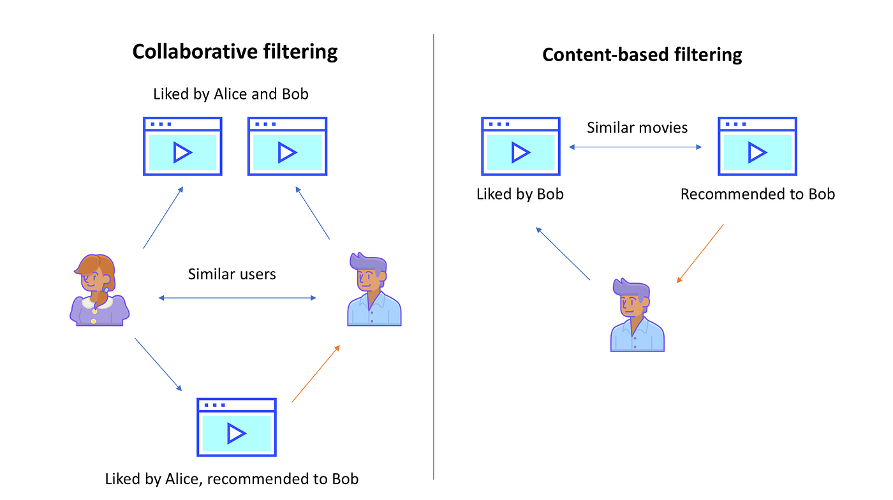
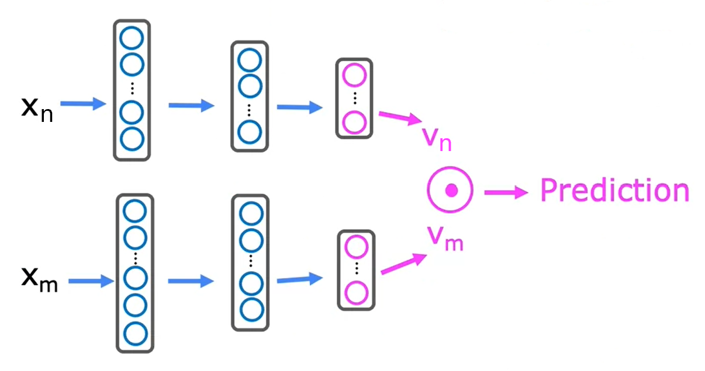

# Recommender Systems

Recommender systems are a subclass of machine learning, which rank predictions based on a set of criteria. The rankings are tailored, then returned, to each training example. Training examples usually end up being a unique identifier, such as a specific user or product, rather than random data. Thus, these systems are especially useful in customizing content and data to specific needs, such as songs, news, products, etc., based on user preferences. The two core algorithms for recommender systems are **collaborative filtering** and **content-based**.

The basic form of a recommender system is a $n_i$ x $n_j$ matrix, where,

- $n_i$ = number of items
- $n_j$ = number of users

Notice how both axes have swapped positions, when compared to a traditional machine learning dataset. Since recommender systems provide rankings, the data points at each position $y^{(i,j)}$ are a numerical rating, which allows them to be compared against each other.  

## Using Per-Item Features

When a recommender system needs to rank data, it is useful for the data to have extra details, which come in the form of additional features. For example, consider a movie recommendation system. Instead of the data just being various movie scores for each user, additional features could include genre, box office revenue, etc.

Additional features are treated as a vector $\vec x^{(i)}$ for each item in the dataset.

# Defining the Cost Function

Recommender systems have many options for defining a cost function, such as the mean squared error, mean absolute error, support vector machines. For the purpose of this explanation, the model will be based on the linear regression function.

### Cost Function Definition for Single User

$$
J(w^{(j)}, b^{(j)}) = \frac{1}{2m} \sum_{i:y(i,j)=1}^{m} (w^{(j)} \cdot x^{(i)} + b^{(j)} - y^{(i,j)})^2
$$

Like other cost functions, the goal is to find the optimal parameters $w^{(j)}, b^{(j)}$ that minimizes cost. There are a few subtle differences here, one of which being the sum limit $i:r(i,j)=1$. This is just like the regular iterator, $i=1$, except it handles cases where there may be an $null$ or undefined value for a specific rating. Since not every user has data for every item metric, this is necessary. $y^{(i,j)}$ represents the specific data point for an item $i$ and user $j$.

### Regularized Cost Function Definition for Single User

$$
J(w^{(j)}, b^{(j)}) = \frac{1}{2m^{(j)}} \sum_{i:y(i,j)=1}^{m} (w^{(j)} \cdot x^{(i)} + b^{(j)} - y^{(i,j)})^2 + \frac{\lambda}{2m^{(j)}} \sum_{k=1}^n (w_k^{(j)})^2
$$

Keep in mind, these two functions are to learn parameters $w^{(j)}, b^{(j)}$ for user $j$. This function needs to be expanded to learn for all parameters $w^{(j)}, b^{(j)}, \dots, w^{(n_u)}, b^{(n_u)}$ for all users:

### Final Cost Function Definition for All Users

$$
J \begin{pmatrix} w^{(1)}, \dots, w^{(n_u)} \\ b^{(1)}, \dots, b^{(n_u)} \end{pmatrix} = \frac{1}{2} \sum_{j=1}^{n_u} \sum_{i:y(i,j)=1} (w^{(j)} \cdot x^{(i)} + b^{(j)} - y^{(i,j)})^2 + \frac{\lambda}{2} \sum_{j=1}^{n_u} \sum_{k=1}^n (w_k^{(j)})^2
$$

# Defining the Collaborative Filtering Algorithm

If the extra features $\vec x$ have unknown values, it is perfectly acceptable to still create the model. To do this, good values for $w,b$ should be chosen, and the feature vectors can be reversed engineered off those values. This only works because the model has parameter values before feature values.

Why not apply this same of reverse engineering parameters to other statistical models like linear regression? Well, recommender systems have multiple users and ratings of the same items from these different users. This lets the algorithm compare its data against itself. A typical linear regression context only has one user, so there’s not enough data.

Collaborative filtering gets its name from comparing all users against all items - all users collaborate to generate the ratings set $R$.

To learn new features from the dataset, the cost function is used. To learn one single feature $x^{(i)}$, the cost function is defined as,

$$
J(x^{(i)}) = \frac{1}{2} \sum_{j:r(i,j)=1} (w^{(j)} \cdot x^{(i)} + b^{(j)} - y^{(i,j)})^2 + \frac{\lambda}{2} \sum_{k=1}^n (x_k^{(i)})^2
$$

The term $j:r(i,j)=1$ means “for all $j$ if $r(i,j) = 1$”. $r$ is similar to $y$, except it is a binary value used to determine if a rating is present (1 if so, 0 if undefined).

Thus, to learn all new features $x^{(1)}, \dots, x^{n_m}$, the cost function is defined as,

$$
J(x^{(i)}, \dots, x^{(n_m)}) = \frac{1}{2} \sum_{i=1}^{n_m} \sum_{j:r(i,j)=1} (w^{(j)} \cdot x^{(i)} + b^{(j)} - y^{(i,j)})^2 + \frac{\lambda}{2} \sum_{i=1}^{n_m} \sum_{k=1}^n (x_k^{(i)})^2
$$

Obviously this is pretty powerful, because up until now, features had to be manually derived. The next step here is figuring out the optimal values for $w,b$. However, this does not have to be a separate process, and in fact, it is possible to combine the cost functions for $w,b,$ and $x$ into one, to find the optimal values for all three vectors,

$$
J(w,b,x) = \frac{1}{2} \sum_{(i,j):r(i,j)=1} (w^{(j)} \cdot x^{(i)} + b^{(j)} - y^{(i,j)})^2 + \frac{\lambda}{2} \sum_{j=1}^{n_u} \sum_{k=1}^n (w_k^{(j)})^2 + \frac{\lambda}{2} \sum_{i=1}^{n_m} \sum_{k=1}^n (x_k^{(i)})^2
$$

## Minimizing the Cost Function

There are several ways to minimize the cost function, the most familiar being . With collaborative filtering, there is an additional parameter $x$ that must be minimized, in addition to the two standard $w,b$.

$$
w_i^{(j)} = w_i^{(j)} - \alpha \frac{\partial}{\partial w_i^{(j)}} J(w,b,x)
$$

$$
b^{(j)} = b^{(j)} - \alpha \frac{\partial}{\partial b^{(j)}} J(w,b,x)
$$

$$
x_k^{(i)} = x_k^{(i)} - \alpha \frac{\partial}{\partial x_k^{(i)}} J(w,b,x)
$$

# Generalizing for Binary Labels

Many applications of recommender systems require binary labels, rather than a range of values. The process for implementing this is very similar to moving from linear regression to logistic regression. Previously, the goal was to predict $y^{(i,j)}$ as $w^{(j)} \cdot x^{(i)} + b^{(j)}$. For binary labels, the goal is,

predict the probability of $y^{(i,j)} = 1$,

given by $g(w^{(j)} \cdot x^{(i)} + b^{(j)})$,

where $g(z) = \frac{1}{1+e^{-z}}$

## Defining the Cost Function

Given the loss for binary labels $y^{(i,j)}$,

$$
f_{(w,b,x)}(x) = g(w^{(j)} \cdot x^{(i)} + b^{(j)})
$$

The loss for a single example can be extrapolated to,

$$
L\big(f_{(w,b,x)}(x),y^{(i,j)}\big) = -y^{(i,j)}\log\big(f_{(w,b,x)}(x)\big) - \big(1 - y^{(i,j)}) \log(1 - f_{(w,b,x)}(x)\big)
$$

And the cost function can be fined as,

### Binary Label Cost Function Definition

$$
J(w,b,x) = \sum_{(i,j):r^{(i,j)}=1} L\big(f_{(w,b,x)}(x),y^{(i,j)}\big)
$$

# Mean Normalization

When a model uses ranking values, such as recommender systems, scaling features is very important, since these values would otherwise have no context. Mean normalization is arguably the most common way to scale features here, to give them consistent values.

This process is also useful for when users have undefined or null values at specific data points. By finding the mean values for each item, the model can still provide recommendations as new users are added, without any data points. It effectively serves as a default value for each item and actually becomes the first guess the model will use, when it starts trying to optimize itself via $w,b$.

To calculate the mean normalization, the average values for all users in the dataset is calculated, which are then stored in a vector. Consider the following, where $n$ and $m$ are the number of items and users, respectively.

$$
\begin{bmatrix} y^{(0,0)} & \cdots & y^{(0,m)} \\ \vdots & & \vdots \\ y^{(n,0)} & \cdots & y^{(n,m)} \end{bmatrix}
$$

$$
\mu = \begin{bmatrix}  \overline{y}^0 \\ \vdots \\ \overline{y}^n \end{bmatrix}
$$

Doing this gives mean values for each of the items in the matrix. Note, for any data point without a rating (contains an undefined value), it will be ignored in the mean computation. So, the mean will calculate $m - null$ user ratings per item.

After this mean has been calculated, the values in the original matrix subtract the mean value $\mu$, for each data point. This normalizes the values to 0. Now, these become the new values for $y^{(i,j)}$.

$$
\begin{bmatrix} y^{(0,0)}-{\mu}_0 & \cdots & y^{(0,m)}-{\mu}_0 \\ \vdots & & \vdots \\ y^{(n,0)} - {\mu}_n & \cdots & y^{(n,m)} - {\mu}_n \end{bmatrix}
$$

Because this process will result in negative-valued data points, this must be accounted for in the model function. Otherwise, the model will predict negative valued ratings, which would then have be normalized back to their original values. Rather than doing this later, the mean normalization vector can simply be added into the model function.

$$
f(x) = w^{(j)} \cdot x^{(i)} + b^{(j)} + u_i
$$

Overall, mean normalization helps the model algorithm run faster. It also helps performance and accuracy when users do not have ratings for any items. Because a default value has been stored, it removes some guesswork from the model’s initial guesses.

On a final note, it is also possible to normalize the columns. This should be done if it makes sense for the model’s application. Though, it is usually more effective and worthwhile to normalize users rather than columns; but it is an option nonetheless.

# Implementing Collaborative Filtering in TensorFlow

## Auto-Differentiation

TensorFlow also has a built in module `tf.GradientTape`, which allows for auto-differentiation (automatically taking the derivative) to be done very simply in one line. It also records the steps to compute the cost function, so they can be referenced later.

This example continues the linear regression model function. Some initial values for the cost function are assumed, such as $b=0$, which is why it is not present anywhere. Also, the `tf.Variable()` function tells TensorFlow that this variable is a parameter that needs to be optimized.

TensorFlow variables need special syntax to modify their values, which is the purpose of the `assign_add()` function.

```python
w = tf.Variable(3.0)
x = 1.0
y = 1.0 # target value
alpha = 0.01

iterations = 30
for iter in range(iterations):
  # Use TensorFlow's Gradient tape to record the steps
  # used to compute the cost J, to enable auto differentiation.
  with tf.GradientTape() as tape:
    f_wb = w*x
     cost = (f_wb - y)**2
    
  # Use the gradient tape to calculate the gradients of
  # the cost wiht respect to the parameter w.
  [dJdw] = tape.gradient(cost, [w])
  
  # Run one step of gradient descent by updating
  # the value of w to reduce the cost.
  w.assign_add(-alpha * dJdw) 

```

Notice how TensorFlow handles almost all of the leg work, and all that is needed from the user is to define the model and cost functions. Everything else, including storing values for reference and updating parameters, is handled by the framework.

## The Collaborative Filtering Algorithm

The parameters passed into the cost function are fairly straightforward, except with some important caveats:

- `Ynorm` is the set of target values normalized.
- `R` defines which datapoints have ratings (so null values are excluded)

```python
# Instantiate an optimizer
optimizer  = keras.optimizers.Adam(learning_rate=1e-1)

iterations = 200
for iter in range(iterations):
  # User TensorFlow's GradientTape to creord the
  # operations used to compute the cost
  with tf.GradientTape() as tape:
   
    # Compute the cost (forward pass is included in cost)
    cost_value = cofiCostFuncV(X, W, b, Ynorm, R, n, m, lambda)
  
  # Use the gradient tape to automatically retrieve the 
  # gradients fo the trainable variables with respect to loss
  grads = tape.gradient(cost_value, [X,W,b])

  # Run one step of the gradient descent by updating the
  # value of the variables to minimize the loss
  optimizer.apply_gradients(zip(grads, [X,W,b]))
```

# Finding Related Items

The features $x^{(i)}$ of item $i$ are actually quite hard to interpret in the collaborative filtering algorithm. However, when analyzing all $n$ features together, it is possible to find relationships between items. To find other items related to item $i$, find item $k$ with $x^{(k)}$ similar to $x^{(i)}$. Given a feature vector $\vec x^{(k)}$, similarity is determined by comparing its distance to feature vector $\vec x^{(i)}$,

$$
distance = \sum_{l=1}^n (x_l^{(k)} - x_l^{(i)})^2 = \lVert x_l^{(k)} - x_l^{(i)}\rVert^2
$$

By summing up the distances and comparing the end results for each other feature, the system can make appropriate recommendations, based on how similar or different they are.

# Defining the Content-based Algorithm

Content based filtering recommends items to users based on features of the user and item to find a good match. Contrast this with collaborative filtering, which recommends items to users based on similar ratings from other users. Note, content based filtering requires features from both users and items.



The key to this algorithm is it makes good use of these features, specifically because it does not simply utilize ratings as data points. Features are traits more commonly found in previously discussed machine learning algorithms. For example, if describing a movie, features could be the year it was released, the genre, reviews, etc. for the item and age, country, number of movies watched, etc. for the user.

It is important to note these features do not replace the ranked ratings themselves, but are added additionally to the dataset. The algorithm is able to utilize both rating and feature values together.

## Defining the model function

Taking the linear regression model used previously, there first step to apply for the content-based algorithm is to drop the parameter $b$. It ends up not having much impact on performance. Next, some simple notation changes are made to $w,x$, to their vector forms. The following equation predicts the rating of user $j$ on item $i$ as,

$v_n^{(j)}$ = the vector computed from the features of user $j$ ($x_n^{(j)}$)

$v_m^{(i)}$ = the vector computed from the features of item $i$ ($x_m^{(i)}$)

$$
f(x) = w^{(j)} \cdot x^{(i)} \rightarrow f(x) = v_n^{(j)} \cdot v_m^{(i)}
$$

By taking the dot product of these two vectors, hopefully it will provide how much a particular user likes/dislikes a particular item. To take this dot product, both vectors need to be the same size.

# Deep Learning for Content-based Filtering

A good way to develop a content-based algorithm is to use deep learning. A neural network develops the feature vectors $v$, by taking the initial features $w, x$ as inputs. Through a combination of layers, it reduces these features to a single output layer (vector) of a specified size.



Notice how this also helps create vectors of the same size, for the dot product in the model function. Each vector is fed into its own neural network, so two at minimum are needed.

Moreover, if a binary classification is needed for the output, the sigmoid function $g(z)$ can be taken to predict the probability $y^{(i,j)} = 1$.

$$
g(z) = g(v_n^{(j)} \cdot v_m^{(i)})
$$

## Defining the cost function

$$
J = \sum_{(i,j):r(i,j)=1} (v_n^{(j)} \cdot v_m^{(i)} - y^{(i,j)})^2 + \text{NN regularization term}
$$

Depending on how the neural network is trained, different values will be calculated for the two parameter vectors $v$. The goal is to find values resulting in a small squared error. Like the collaborative filtering algorithm before, this one will use an optimizer like gradient descent to fine tune the model function.

## Finding similar items

To find a similar item $k$ to item $i$,

$$
distance = \lVert v_m^{(k)} - v_m^{(i)}\rVert^2
$$

Note, this can be pre-computed ahead of time. In other words, finding similar items can be calculated before running the model algorithm itself.

## Optimizations

Finding a suitable balance for how many items the neural network should retrieve (result of output layer) is an important tradeoff. Retrieving more items results in better model performance but slower recommendations. To analyze/optimize the trade-off, carry out offline experiments to see if retrieving additional items results in more relevant recommendations. Use $p(y^{((i,j)})$ to gauge how well it is recommending, with better results being closer to 1.

# Implementing Content-based Filtering in TensorFlow

The code snippets below are the key steps for implementing content-based filtering, which is  very similar to neural network code. After the neural networks have been initialized, the feature vectors for both users and items are extracted and normalized. Their dot product is then taken, so an output is defined. This output, along with the original inputs are fed into the model, along with the cost function definition. The model will then run

```python
user_NN = tf.keras.models.Sequential([
  tf.keras.layers.Dense(256, activation='relu'),
  tf.keras.layers.Dense(128, activation='relu'),
  tf.keras.layers.Dense(32)
])

item_NN = tf.keras.models.Sequential([
  tf.keras.layers.Dense(256, activation='relu'),
  tf.keras.layers.Dense(128, activation='relu'),
  tf.keras.layers.Dense(32)
])

# create the user input and point to the base network
input_user = tf.keras.layers.Input(shape=(num_user_features))
vn = user_NN(input_user)
vn = tf.linalg.12_normalize(vn, axis=1)

# create the item input and point to the base network
input_item = tf.keras.layers.Input(shape=(num_item_features))
vm = user_NN(input_item)
vm = tf.linalg.12_normalize(vm, axis=1)

# measure the similarity of the two vector outputs
output = tf.keras.layers.Dot(axes=1)([vn, vm])

# specify the inputs and output of the model
model = Model([input_user, input_item], output)

# Specify the cost function
cost_fn = tf.keras.losses.MeanSquaredError()
```
