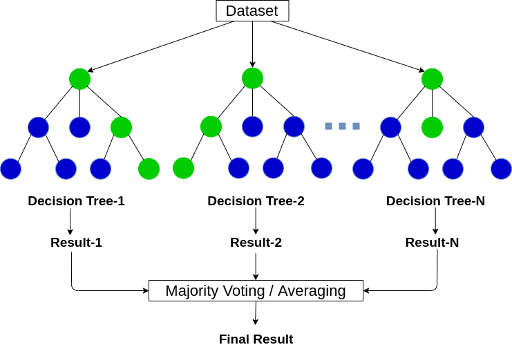

# Tree Ensembles

A tree ensemble is a collection of decision trees, where the output is the class selected by most trees. One of the weaknesses of using a single decision tree is the decision tree can be highly sensitive to small changes in the data. Ensembles are more robust and reduce this sensitivity, especially further down the tree as training data becomes smaller at each node. 



# Sampling with Replacement

Sampling with replacement is a statistics technique for taking a random sample from a set of data, where the chosen output or token is put back into the data before the next sample is taken. Regarding tree ensembles, training examples are mixed in a theoretical bag. After creating an empty training set the same size as the original, examples are randomly pulled from the bag and added to the empty training set. Because this sampling technique uses replacement, duplicate examples can be added. 

Overall, it allows for constructing slightly different training sets (trees) from one original set of data and is the key building block for tree ensembles. Sampling with replacement causes the algorithm to explore small changes in data already, which reduces the sensitivity of the data in and of itself. This allows for small modifications to the training set (adding/removing data) to have a smaller impact on the overall algorithm. 

# Random Forest Algorithm

Random forests are one of the most common and effective tree ensemble algorithms. To construct a random forest, given a training set of size $m$ and for $b=1$ to $B$ number of trees; use sampling with replacement to create a new training set of size $m$, then train a decision tree on the new dataset. This alone creates what is called a bagged ensemble of decision trees.

There is also a technique to further randomize the data, which is to randomize the feature choice too. At each node, when choosing a feature to use to split, if $n$ features are available, pick a random subset of $k<n$ features and allow the algorithm to only choose from that subset of features. A typical choice for $k$, when the number of features is large ($n \gtrsim 20$) is $k= \sqrt{n}$ . Adding this feature choice technique results in the random forest algorithm. 

# Boosted Decision Trees

Another common and effective tree ensemble algorithm is the eXtreme Gradient Boosting algorithm (XGBoost), which is nearly identical to the bagged ensemble of decision trees, except for one key difference: when using sampling with replacement to create a new training set of size $m$, instead of picking from all examples with equal ($\frac{1}{m}$) probability, make the sampling more likely to pick misclassified examples from previously trained trees. Focusing on what the decision tree is not doing well on (misclassified examples) is the idea behind boosting, and it helps the learning algorithm do better more quickly. The exact mathematics behind the probability of picking misclassified data is quite complicated. 

Along with being a fast and efficient implementation, XGBoost is also a good choice of default splitting criteria for when to stop splitting. It also has built in regularization to prevent overfitting. Because of these key features, it is a highly competitive algorithm (along with deep learning algorithms) for machine learning competitions. On a technical note, because XGBoost assigns different probabilities for training examples, it doesn’t need to generate a lot of randomly chosen samples and is a little more efficient than sampling with replacement. 

The exact algorithm is quite complicated, but luckily it is built in to many open source tools. The following code are sample implementations in TensorFlow.

### Classification

```python
from xgboost import XGBClassifier

model = XGBClassifier()

model.fit(X_train, y_train)
y_pred = model.predict(X_test)
```

### Regression

```python
from xgboost import XGBRegressor

model = XGBRegressor()

model.fit(X_train, y_train)
y_pred = model.predict(X_test)
```

# Decision Trees vs Neural Networks

### Decision Trees and Tree Ensembles

- Works well on tabular (structured) data, like data that fits well in a spreadsheet.
- Not recommended for unstructured data (images, audio, text).
- Fast to train, which in turn can make the overall development process faster.
- Small decision trees can be human interpretable, thus intuitive to understand.
- In almost all applications, XGBoost should be used as the go-to algorithm, with exceptions for niche cases.

### Neural Networks

- Works well on all types of data, including tabular (structured) and unstructured data (images, audio, text).
- May be slower than a decision tree.
- Works with transfer learning, which is especially important when using data/models from the community.
- When building a system of multiple models working together, it might be easier to string together multiple neural networks.